# Post-Deployment Vulnerability Remediation Architecture Documentation

## Executive Summary

Post-Deployment Vulnerability Remediation answers critical questions for every high-risk OSS vulnerability: **"What's the threat? Where do I fix it? Where is it running? How do I fix it?"**

The system bridges four key domains:

1. **Vulnerabilities (The Threat)** - CVE data from OSV.dev including affected packages, severity levels, version ranges, and fix information
2. **Project Releases (Where to Fix It)** - Git repositories, SBOMs, dependencies, binary artifacts, and release metadata from GitHub/GitLab
3. **Synced Endpoints (Where It's Running)** - Production deployments across cloud providers, Kubernetes clusters, serverless functions, edge devices, and mission assets
4. **Mitigations (How to Fix It)** - Actionable remediation guidance including fixed versions, affected releases, deployment impact analysis, and automated issue creation

### Value Proposition

By connecting vulnerability data with project releases, deployment locations, and remediation paths, the system enables security teams to:

- Immediately identify which production systems are affected by new CVEs
- Trace vulnerable packages back to source code repositories
- Determine exact versions that need updating
- Locate deployment configurations for remediation
- Prioritize fixes based on actual deployment exposure and severity
- Generate automated remediation workflows (Jira, GitHub, GitLab issues, AI Auto-remediation)
- Track mitigation progress across the entire software supply chain

### Integration Points

**At Setup, Users Connect:**

| Code Repository          | Binary Repository      | Deployment Infrastructure      | Issue Tracking               |
|--------------------------|------------------------|--------------------------------|------------------------------|
| GitHub/GitLab repos      | Quay, DockerHub        | Kubernetes clusters            | Jira, GitHub Issues          |
| SBOMs & dependency files | ArtifactHub, Sonatype  | AWS/Azure/GCP endpoints        | GitLab Issues                |
| Source code & commits    | JFrog, GitHub Packages | Edge devices, IoT, satellites  | AI Auto-remediation          |

## Functional Requirements

### Vulnerability Data Management

The system automatically ingests vulnerability data from OSV.dev on a scheduled basis, supporting all major package ecosystems including npm, PyPI, Maven, Go, NuGet, and RubyGems. Vulnerability records are normalized into a consistent format, extracting Package URLs (PURLs) and deduplicating based on CVE identifiers and modification timestamps.

**CVSS Score Calculation:** During ingestion, the system parses CVSS v3.0, v3.1, and v4.0 vector strings (e.g., `CVSS:3.1/AV:N/AC:L/PR:N/UI:N/S:U/C:H/I:H/A:H`) using the `github.com/pandatix/go-cvss` library to calculate accurate numeric base scores. These calculated scores are stored in the `database_specific` field alongside severity ratings (CRITICAL, HIGH, MEDIUM, LOW). CVEs without severity
information are automatically assigned a LOW severity rating (score: 0.1) to ensure comprehensive tracking. This pre-calculation approach eliminates runtime parsing overhead and enables efficient severity-based queries.

**Severity Rating Mappings:**

- **CRITICAL**: CVSS score 9.0 - 10.0
- **HIGH**: CVSS score 7.0 - 8.9
- **MEDIUM**: CVSS score 4.0 - 6.9
- **LOW**: CVSS score 0.1 - 3.9 (includes CVEs with missing or unparseable severity data)
- **NONE**: CVSS score 0.0

When configured, the system enriches vulnerability data with MITRE ATT&CK technique mappings to provide additional context about attack patterns. All vulnerability information includes severity scores (CVSS), severity ratings, affected version ranges, and available fix versions.

### Release and SBOM Processing

The system accepts Software Bill of Materials (SBOMs) in CycloneDX format through both REST API and CLI interfaces. Each SBOM undergoes validation to ensure structural correctness before processing. The system extracts component information including package names, versions, and PURLs from the SBOM content. Comprehensive git metadata is automatically collected from repositories, including commit
hashes, branch information, author details, and timestamps. Releases are deduplicated using a composite key of name, version, and content SHA, while SBOMs are deduplicated using SHA256 content hashing to prevent redundant storage. The system supports multiple project types (applications, libraries, Docker containers) and maintains relationships between releases and their corresponding SBOMs.

### Sync and Endpoint Management

The system tracks deployment of releases to endpoints, creating a complete picture of where software is running in production. Endpoints represent deployment targets such as Kubernetes clusters, cloud instances (EC2, Lambda, ECS), edge devices, IoT systems, and mission assets. Each endpoint is classified by type and environment (production, staging, development). Sync records associate specific
release versions with endpoints, recording when each deployment occurred. This enables the system to answer "where is this vulnerability running" by traversing from CVEs through releases to their deployed endpoints. The unique composite index on sync records prevents duplicate deployments while supporting multiple syncs of the same release to different endpoints.

### Vulnerability Analysis

The system performs sophisticated vulnerability matching by connecting CVEs to affected releases through PURL-based graph relationships. Version matching follows OSV specifications, supporting both semantic versioning (SEMVER) and ecosystem-specific version schemes. The matching logic accurately identifies all releases affected by a given CVE and all CVEs affecting a given release.
Version-specific matching is achieved through metadata stored on graph edges, allowing precise filtering that eliminates false positives. The system handles complex version range specifications including minimum versions, maximum versions, and specific version exclusions.

**Severity-Based Filtering:** Queries can filter vulnerabilities by severity rating (CRITICAL, HIGH, MEDIUM, LOW) using pre-calculated values stored during ingestion. The system performs efficient string-based filtering on severity ratings rather than complex numeric range calculations, significantly improving query performance. All severity-based queries traverse from CVEs through PURLs to
releases and their deployed endpoints, providing complete impact analysis at any severity threshold.

### Query and Reporting

Users can query the system through GraphQL API endpoints to retrieve vulnerability information, release details, and deployment status. The system provides comprehensive listing of all releases with basic metadata, detailed retrieval of specific releases including full SBOMs, vulnerability reports for individual releases showing all affecting CVEs, and impact analysis for CVEs showing all
affected releases and endpoints. Severity-based queries return all releases or endpoints affected by vulnerabilities at a specified severity level (CRITICAL, HIGH, MEDIUM, or LOW). All responses include actionable information such as severity levels, severity ratings, numeric CVSS scores, fix versions, affected packages, endpoint locations, and source repository information. The CLI supports
exporting SBOMs to files for offline analysis and integration with other tools.

### Mitigation Capabilities

The system provides a comprehensive mitigation view that aggregates vulnerability data across releases and endpoints, showing:

- CVE identification and severity classification
- Affected package versions and fixed-in versions
- Count of affected releases and deployed endpoints
- Ability to select multiple vulnerabilities for bulk action
- Integration with issue tracking systems (Jira, GitHub Issues, GitLab Issues)
- AI-powered auto-remediation workflows

This enables security teams to:

- Prioritize remediation based on deployment exposure
- Create tracking tickets in their preferred issue management system
- Coordinate fixes across multiple affected releases
- Track remediation progress to completion

### Integration Capabilities

The system integrates with GitHub and GitLab repositories to collect source code metadata, build information, and commit histories. Support for multiple binary repositories (Quay, DockerHub, ArtifactHub, Sonatype, JFrog) enables tracking of artifacts through the software supply chain. Deployment tracking through sync records allows the system to understand where
vulnerable code is actually running. Metadata collection works seamlessly in CI/CD environments including GitHub Actions and Jenkins, automatically gathering build numbers, URLs, and timestamps.

## Non-Functional Requirements

### Performance and Scalability

The system is designed to handle large-scale vulnerability management workloads with optimal end-user experience. All API endpoints maintain an end-user response time of less than 3 seconds under normal load conditions, including:

- Release upload with SBOM processing
- Vulnerability query for releases with up to 500 components
- Severity-based filtering across large datasets (affected-releases, affected-endpoints)
- Release-to-endpoint impact analysis with graph traversal
- List operations for releases, endpoints, and syncs

Individual CVE records are processed and stored during ingestion with CVSS score calculation adding negligible overhead (<1ms per CVE). The ingestion pipeline can process over 50,000 CVE records per hour. The API service handles concurrent requests from 100+ clients without degradation. Database indexes optimize query performance for common access patterns, including a persistent index on
`database_specific.severity_rating` for fast severity-based filtering. Connection pooling ensures efficient resource utilization.

The system scales to support over one million releases, 500,000 unique SBOMs, 100,000 CVE records, and unlimited endpoint/sync records while maintaining responsive query performance. Severity-based queries use optimized single-pass traversal with string-based filtering to avoid loading large result sets into memory.

**Deployment Strategy:** Rolling updates are used for all system deployments to ensure zero-downtime operation and eliminate the need for maintenance windows. The rolling update strategy progressively replaces instances of the previous version with the new version, maintaining service availability throughout the deployment process.

### Reliability and Availability

The API service maintains 99.9% uptime during business hours through robust error handling and recovery mechanisms. Database connections implement exponential backoff retry logic to handle transient failures gracefully. The system recovers from network interruptions without data loss and uses panic recovery middleware to prevent service crashes from unexpected errors. All input data undergoes
validation before processing to ensure data quality. The CVE ingestion job retries failed downloads up to three times before logging errors for manual intervention. CVSS parsing errors are logged but do not prevent CVE ingestion—CVEs with unparseable CVSS vectors are assigned default LOW severity to ensure comprehensive coverage.

### Security

Security is embedded throughout the system architecture. All external communications use TLS 1.2 or higher for encryption. The system verifies GPG signatures on git commits when available to ensure code authenticity. ZipSlip protection prevents directory traversal attacks during archive extraction. All user inputs are sanitized to prevent injection attacks. Database connections require
authentication, and sensitive credentials are never exposed in logs or error messages. CORS policies control API access, and SBOM content undergoes validation to prevent malicious data injection.

### Maintainability and Observability

The system uses structured logging with Zap to provide consistent, searchable log output across all components. Health check endpoints enable monitoring systems to verify service status. All CVE ingestion operations and API requests are logged with timestamps and response times for operational insight. CVSS calculation success and failures are logged with relevant vector strings for
troubleshooting. The codebase maintains modular package architecture with clear separation of concerns, making it easy to understand and modify. API endpoints are fully documented with examples, and the CLI provides helpful error messages with suggested remediation steps. Database schema changes follow backwards compatibility principles to enable zero-downtime deployments.

### Portability and Interoperability

The system runs on Linux, macOS, and Windows, deployable via Docker containers and Kubernetes with Helm charts. All configuration uses environment variables, avoiding platform-specific dependencies. The implementation complies with industry standards including the CycloneDX SBOM specification, Package URL (PURL) specification, OSV vulnerability data format, and CVSS v3.0/v3.1/v4.0 specifications.
REST API follows standard HTTP conventions for methods and status codes, with JSON as the primary data exchange format. Semantic versioning specification governs all version comparisons, ensuring consistent behavior across different package ecosystems.

## Overview

Post-Deployment Vulnerability Remediation is a comprehensive vulnerability management system built in Go that tracks relationships between software releases, their Software Bill of Materials (SBOMs), known CVEs, deployment endpoints, and remediation actions. The system uses a graph database (ArangoDB) to create a hub-and-spoke architecture that enables efficient vulnerability analysis across software components and
identifies where vulnerable code is running in production with actionable remediation paths.

## Data Flow: Answering the Four Key Questions

### Question 1: "What's the threat?" (Vulnerabilities)

**Data Sources:**

- **OSV.dev API**: CVE records with CVSS vectors, affected packages, version ranges
- **MITRE ATT&CK**: Technique mappings (optional)
- **CVSS Parser**: Real-time score calculation and severity rating assignment

**Flow:**

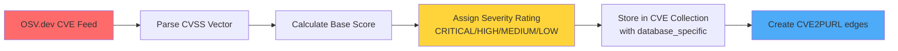

**Result:** Security teams can filter and prioritize vulnerabilities by severity, understand attack patterns, and identify affected packages with precise CVSS scoring.

### Question 2: "Where do I fix it?" (Project Releases)

**Data Sources:**

- **GitHub/GitLab**: Git commits, branches, tags, metadata
- **CI/CD Systems**: Build information, timestamps, URLs
- **SBOM Files**: CycloneDX component inventory
- **OpenSSF Scorecard**: Security posture scores

**Flow:**

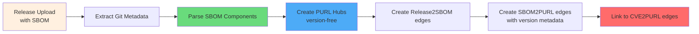

**Result:** Development teams know which source code repositories, branches, and commits contain vulnerable dependencies, with OpenSSF security scores to prioritize remediation efforts.

### Question 3: "Where is it running?" (Synced Endpoints)

**Data Sources:**

- **Sync API**: Deployment associations (release → endpoint)
- **Endpoint Registry**: Kubernetes clusters, cloud instances, edge devices, mission assets
- **Environment Tags**: Production, staging, development classifications

**Flow:**

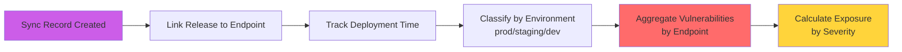

**Result:** Operations teams know exactly which production systems, environments, and mission-critical assets are running vulnerable code, with vulnerability counts by severity level.

### Question 4: "How do I fix it?" (Mitigations)

**Data Sources:**

- **Fix Information**: OSV.dev fixed-in versions
- **Release Aggregation**: Count of affected releases per CVE
- **Endpoint Aggregation**: Count of affected endpoints per CVE
- **Issue Tracking**: Jira, GitHub, GitLab integration APIs

**Flow:**

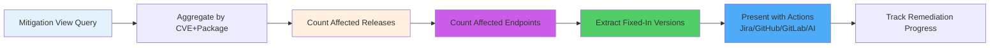

**Result:** Security and development teams have actionable remediation plans with:

- Specific fixed versions to upgrade to
- Full scope of impact (releases + endpoints)
- Automated issue creation in their workflow tools
- Tracking mechanisms to monitor fix deployment

## Database Structure

The system uses ArangoDB, a multi-model database that supports both document storage and graph relationships. The database schema implements a hub-and-spoke architecture using PURL nodes as central hubs to connect CVEs with releases through their SBOMs, and extends to track which releases are synced to which endpoints.

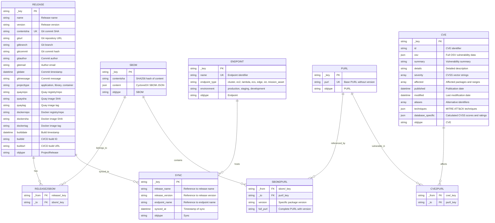

## Hub-and-Spoke Architecture: Visual Guide

This section provides visual representations of the hub-and-spoke architecture to make it easier to understand how vulnerabilities, packages, and releases are connected. See [Hub and Spoke Guide](hub_and_spoke_guide.md) for detailed explanation and examples.

### Architecture Overview Diagram

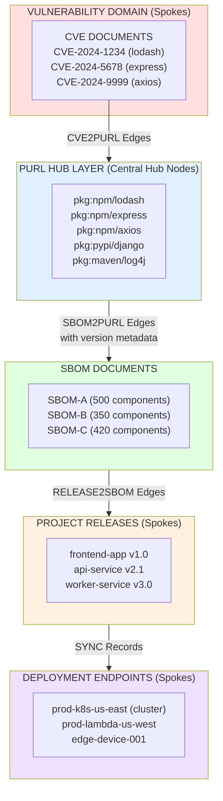

### Detailed Hub Example: Single Package

This diagram shows how multiple CVEs and multiple SBOMs connect through a single PURL hub:

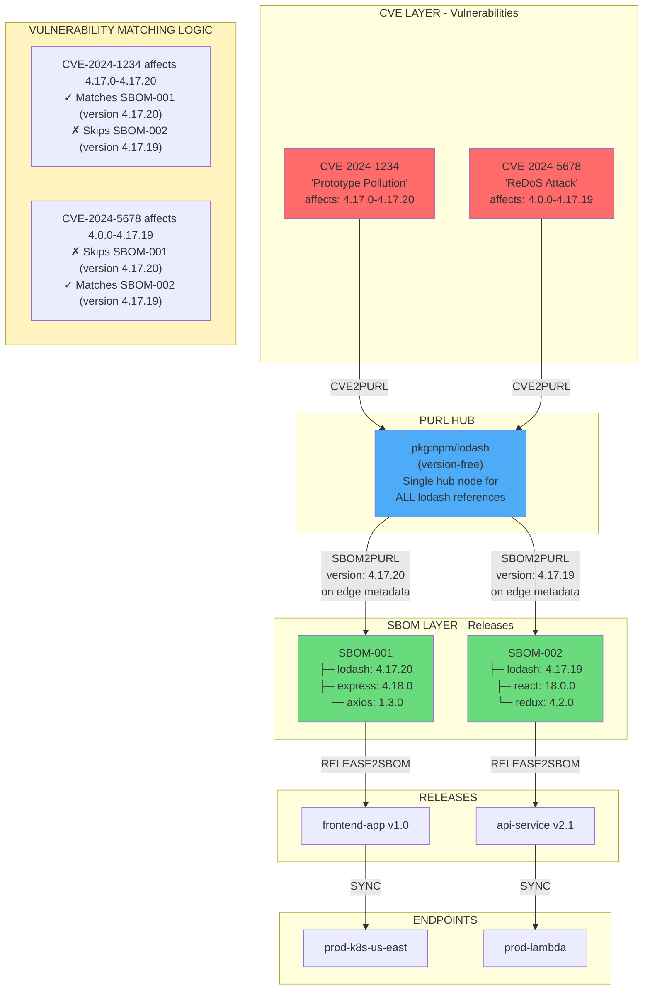

### Query Flow Visualization

This shows how a query traverses the graph from CVE to deployed endpoint:


### Key Design Features

#### Hub-and-Spoke Architecture (Detailed)

The system implements a **hub-and-spoke architecture** using PURL (Package URL) nodes as central hubs to efficiently connect vulnerability data with software releases through their SBOMs. This architectural pattern is commonly used in graph databases to optimize queries and reduce data duplication.

**Core Concept:**

Instead of creating direct connections between every CVE and every SBOM component (which would result in exponential edge growth), we use PURL nodes as intermediary hubs. Think of it like an airport hub system: rather than having direct flights between every pair of cities, major airlines route through hub airports, significantly reducing the number of routes needed.

**Version Storage Strategy**: While PURL nodes store base package identifiers without versions (e.g., `pkg:npm/lodash`), the SBOM2PURL edges store specific version information (e.g., `4.17.20`). This enables accurate vulnerability matching where CVEs specify affected version ranges.

**Content-Based Deduplication**: Releases use composite natural keys (name + version + contentsha) to handle rebuild scenarios, while SBOMs use SHA256 content hashing to enable sharing across multiple releases with identical dependencies.

**CVSS Pre-Calculation**: CVE documents include a `database_specific` field containing pre-calculated CVSS scores and severity ratings. This field structure is:

```json
{
  "cvss_base_score": 9.8,
  "cvss_base_scores": [9.8],
  "severity_rating": "CRITICAL"
}
```

This design enables fast severity-based queries using indexed string comparisons instead of runtime parsing and numeric calculations.

**Sync Tracking**: Sync records create the critical link between releases and endpoints, enabling queries that answer "where is this vulnerability running in production?" Each sync records when a specific release version was deployed to a specific endpoint.

**Composite Indexes**: Multi-field indexes on `release.name + release.version`, `sbom2purl._to + sbom2purl.version`, `sync.release_name + sync.release_version + sync.endpoint_name`, and `cve.database_specific.severity_rating` optimize common query patterns.

**Bidirectional Traversal**: Edge collections are indexed on both `_from` and `_to` fields, enabling efficient graph traversal in both directions—from CVE to affected releases/endpoints and from releases/endpoints to applicable CVEs.

### CVE Database Specific Field Structure

The `database_specific` field in CVE documents stores calculated CVSS information:

```json
{
  "_key": "CVE-2024-1234",
  "id": "CVE-2024-1234",
  "severity": [
    {
      "type": "CVSS_V3",
      "score": "CVSS:3.1/AV:N/AC:L/PR:N/UI:N/S:U/C:H/I:H/A:H"
    }
  ],
  "database_specific": {
    "cvss_base_score": 9.8,
    "cvss_base_scores": [9.8],
    "severity_rating": "CRITICAL"
  }
}
```

**Field Descriptions:**

- `cvss_base_score`: Highest numeric CVSS score (used for sorting and display)
- `cvss_base_scores`: Array of all calculated scores (for CVEs with multiple CVSS vectors)
- `severity_rating`: String value (CRITICAL, HIGH, MEDIUM, LOW, NONE) used for filtering

**Default Values:**
CVEs without parseable CVSS vectors receive:

- `cvss_base_score`: 0.1
- `cvss_base_scores`: [0.1]
- `severity_rating`: "LOW"

## CVSS Score Calculation Pipeline

### Ingestion Process

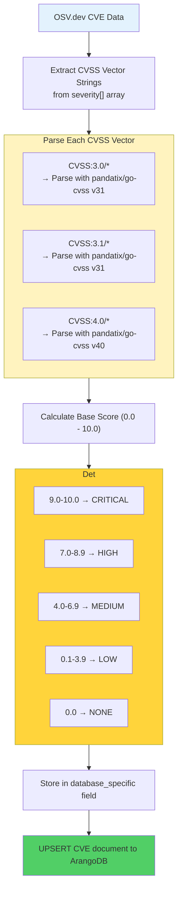

### Query Optimization

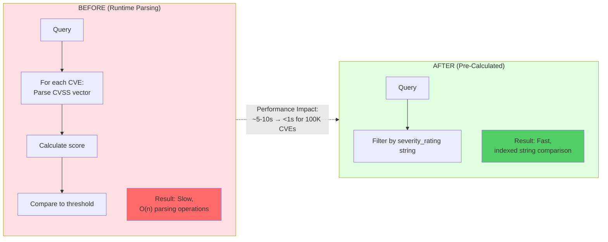

## Sync and Endpoint Architecture

### Endpoint Management

Endpoints represent deployment targets where releases are synced (deployed). Each endpoint has:

- **Name**: Unique identifier for the endpoint
- **Type**: Classification of the deployment target
- **Environment**: Operational context (production, staging, development)

**Supported Endpoint Types:**

- **Cloud Infrastructure**: cluster, ec2, lambda, ecs, eks, gke, aks, fargate
- **Edge Computing**: edge, iot
- **Mission Assets**: mission_asset (military and defense systems including satellites, ground systems, aircraft, ships, submarines, tanks, command posts, etc.)

### Sync Records

Sync records track when a specific release version is deployed to an endpoint:

```json
{
  "release_name": "my-api-service",
  "release_version": "v2.1.0",
  "endpoint_name": "production-us-east-1",
  "synced_at": "2024-01-15T10:30:00Z"
}
```

**Unique Constraint**: Combination of `release_name + release_version + endpoint_name` ensures idempotent sync operations.

**Use Cases:**

- Track deployment history for audit trails
- Identify which releases are currently running on which endpoints
- Determine blast radius of vulnerabilities (how many endpoints affected)
- Generate deployment reports by environment or endpoint type

## Core Operations

### 1. CVE Ingestion with CVSS Calculation

**Process:**

```bash
# Scheduled job runs periodically
./cve2release-tracker
```

**Steps:**

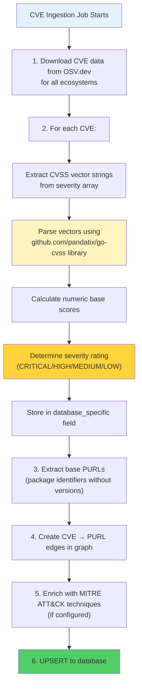

### 2. Release and SBOM Upload

**API Endpoint:**

```bash
POST /api/v1/releases
```

**Request Body (ReleaseWithSBOM):**

```json
{
  "name": "my-service",
  "version": "1.0.0",
  "projecttype": "application",
  "contentsha": "abc123def456",
  "giturl": "https://github.com/org/repo",
  "gitbranch": "main",
  "gitcommit": "abc123",
  "gitcommittimestamp": "2024-01-15T10:00:00Z",
  "sbom": {
    "content": {
      "bomFormat": "CycloneDX",
      "specVersion": "1.4",
      "components": [...]
    }
  }
}
```

**Process:**

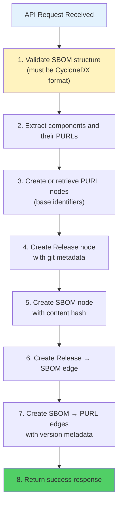

### 3. Endpoint Sync

**API Endpoint:**

```bash
POST /api/v1/sync
```

**Request Body:**

```json
{
  "release_name": "my-service",
  "release_version": "1.0.0",
  "endpoint_name": "prod-k8s-us-east"
}
```

**Process:**

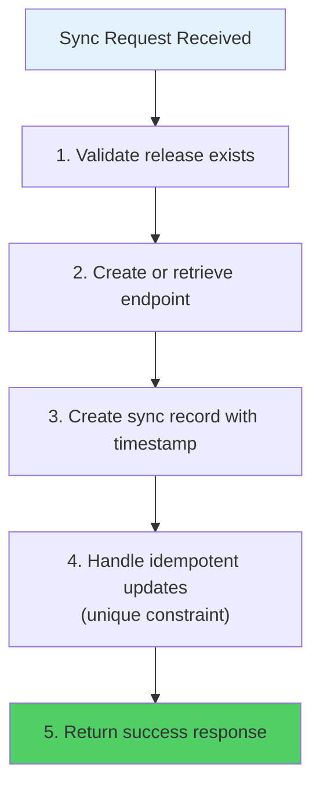

### 4. Vulnerability Queries

#### Query CVEs Affecting a Release

**GraphQL Query:**

```graphql
query GetRelease($name: String!, $version: String!) {
  release(name: $name, version: $version) {
    name
    version
    vulnerabilities {
      cve_id
      severity_score
      severity_rating
      package
      affected_version
      summary
    }
  }
}
```

**Graph Traversal:**

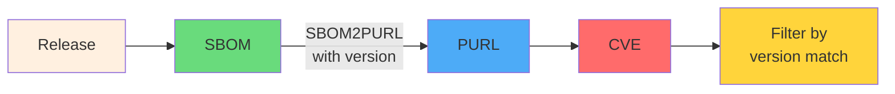

#### Query Releases Affected by Severity

**GraphQL Query:**

```graphql
query GetAffectedReleases($severity: Severity!, $limit: Int) {
  affectedReleases(severity: $severity, limit: $limit) {
    cve_id
    severity_score
    severity_rating
    package
    affected_version
    release_name
    release_version
  }
}
```

#### Query Affected Endpoints for a Release

**GraphQL Query:**

```graphql
query GetAffectedEndpoints($name: String!, $version: String!) {
  affectedEndpoints(name: $name, version: $version) {
    endpoint_name
    endpoint_url
    endpoint_type
    environment
    last_sync
    status
  }
}
```

#### Query All Vulnerabilities (Mitigations View)

**GraphQL Query:**

```graphql
query GetVulnerabilities($limit: Int) {
  vulnerabilities(limit: $limit) {
    cve_id
    summary
    severity_score
    severity_rating
    package
    affected_version
    full_purl
    fixed_in
    affected_releases
    affected_endpoints
  }
}
```

**Response:**

```json
{
  "data": {
    "vulnerabilities": [
      {
        "cve_id": "CVE-2024-1234",
        "summary": "Prototype pollution vulnerability",
        "severity_score": 9.8,
        "severity_rating": "CRITICAL",
        "package": "pkg:npm/lodash",
        "affected_version": "4.17.20",
        "full_purl": "pkg:npm/lodash@4.17.20",
        "fixed_in": ["4.17.21"],
        "affected_releases": 15,
        "affected_endpoints": 23
      }
    ]
  }
}
```

### 5. Severity-Based Impact Analysis

**Query Releases by Severity:**

```bash
GET /api/v1/graphql
```

**GraphQL Query:**

```graphql
query GetAffectedReleases($severity: Severity!, $limit: Int) {
  affectedReleases(severity: $severity, limit: $limit) {
    cve_id
    severity_score
    severity_rating
    package
    affected_version
    release_name
    release_version
    content_sha
    project_type
  }
}
```

**Query Endpoints by Severity:**

```graphql
query GetSyncedEndpoints($limit: Int) {
  syncedEndpoints(limit: $limit) {
    endpoint_name
    total_vulnerabilities {
      critical
      high
      medium
      low
    }
  }
}
```

## Deployment Considerations

### Database Indexes

**Required Indexes for Optimal Performance:**

```javascript
// Create index on severity rating for fast filtering
db.cve.ensureIndex({
  type: "persistent",
  fields: ["database_specific.severity_rating"]
});

// Existing indexes
db.release.ensureIndex({
  type: "persistent",
  fields: ["name", "version"],
  unique: true
});

db.sbom2purl.ensureIndex({
  type: "persistent",
  fields: ["_to", "version"]
});
```

### Rolling Update Strategy

The system supports zero-downtime deployments through rolling updates:

**Deployment Process:**

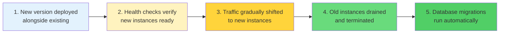

**Benefits:**

- No maintenance window required
- Continuous service availability during updates
- Automatic rollback capability if health checks fail
- Gradual traffic migration minimizes risk

**Kubernetes Example:**

```yaml
apiVersion: apps/v1
kind: Deployment
metadata:
  name: cve-tracker-api
spec:
  replicas: 3
  strategy:
    type: RollingUpdate
    rollingUpdate:
      maxSurge: 1
      maxUnavailable: 0
  template:
    spec:
      containers:
      - name: api
        livenessProbe:
          httpGet:
            path: /
            port: 8080
        readinessProbe:
          httpGet:
            path: /
            port: 8080
```

### CVE Re-Ingestion

**Important:** Existing CVEs need to be re-processed to populate CVSS scores.

**Options:**

1. **Full Re-Ingestion** (Recommended)

   ```bash
   # Clear existing CVEs
   # Run CVE loader with CVSS calculation
   ./cve2release-tracker
   ```

2. **Migration Script** (For large datasets)

   ```javascript
   // ArangoDB migration to set default LOW severity
   FOR cve IN cve
     FILTER cve.database_specific.severity_rating == null
     UPDATE cve WITH {
       database_specific: MERGE(
         cve.database_specific || {},
         {
           cvss_base_score: 0.1,
           cvss_base_scores: [0.1],
           severity_rating: "LOW"
         }
       )
     } IN cve
   ```

### Configuration

**Environment Variables:**

```bash
# CVSS Calculation
ENABLE_CVSS_CALCULATION=true

# Logging
LOG_LEVEL=info
LOG_CVSS_PARSE_ERRORS=true

# Database
ARANGO_HOST=localhost
ARANGO_PORT=8529
ARANGO_USER=root
ARANGO_PASS=password
ARANGO_URL=http://localhost:8529

# MITRE ATT&CK (optional)
MITRE_MAPPING_URL=https://your-mitre-service/api/map

# Performance
MAX_CONCURRENT_REQUESTS=100
REQUEST_TIMEOUT=3s
```

## Conclusion

This Post-Deployment Vulnerability Remediation system provides comprehensive visibility into software vulnerabilities across the entire deployment lifecycle, organized around four key domains that answer critical security questions.

The system connects CVE data with releases, SBOMs, and actual deployment endpoints, enabling security teams to:

1. **Understand The Threat** - View all vulnerabilities with accurate CVSS scoring and severity classification
2. **Identify Where to Fix** - Trace vulnerable packages to source code repositories and specific releases
3. **Locate Where It's Running** - See exactly which production systems and environments are affected
4. **Execute Remediation** - Take action through integrated workflows (Jira, GitHub, GitLab, AI auto-remediation)

The hub-and-spoke architecture ensures scalability and performance, while the sync tracking mechanism provides the crucial link between code and production systems. The addition of pre-calculated CVSS scores and severity ratings enables efficient, real-time severity-based filtering and prioritization, with all API operations completing within 3 seconds to ensure optimal end-user experience. The
rolling update deployment strategy ensures continuous availability, eliminating the need for maintenance windows while maintaining service quality.

**Key Benefits:**

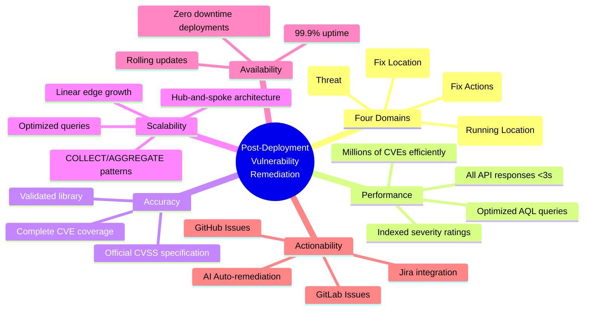

- **Four-Domain Model**: Comprehensive view from threat identification to remediation execution
- **Performance**: All API responses <3 seconds for optimal user experience
- **Accuracy**: Uses official CVSS specification via validated library
- **Completeness**: All CVEs have severity ratings, even those with missing data
- **Scalability**: Indexed severity ratings support millions of CVEs efficiently
- **Availability**: Rolling updates ensure zero-downtime deployments
- **Reliability**: 99.9% uptime with no maintenance windows required
- **Actionability**: Integrated workflows for Jira, GitHub, GitLab, and AI auto-remediation
- **Query Optimization**: COLLECT/AGGREGATE/SORT patterns ensure efficient data processing
