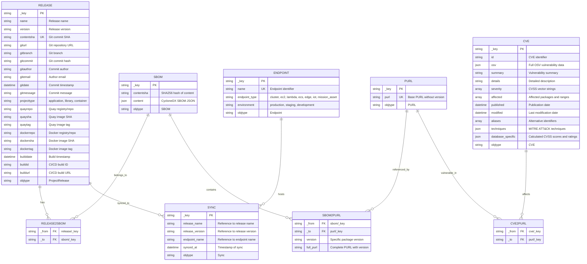

# Post-Deployment Vulnerability Remediation Architecture Documentation

## Executive Summary

Post-Deployment Vulnerability Remediation answers two critical questions for every high-risk OSS vulnerability: **"Where is it running, and how do I fix it?"**

The system bridges three key domains:

1. **Vulnerabilities (The Threat)** - CVE data from OSV.dev including affected packages, severity levels, version ranges, and fix information
2. **Project Releases (Where to Fix It)** - Git repositories, SBOMs, dependencies, binary artifacts, and release metadata from GitHub/GitLab
3. **Deployment Endpoints (Where It's Running)** - GitOps configurations showing production deployments across cloud providers

### Value Proposition

By connecting vulnerability data with project releases and their deployment locations, the system enables security teams to:

- Immediately identify which production systems are affected by new CVEs
- Trace vulnerable packages back to source code repositories
- Determine exact versions that need updating
- Locate deployment configurations for remediation
- Prioritize fixes based on actual deployment exposure

### Integration Points

**At Setup, Users Connect:**

| Code Repository | Binary Repository | GitOps Repository |
|----------------|-------------------|-------------------|
| GitHub/GitLab repos | Quay, DockerHub | GitHub/GitLab deployment repos |
| SBOMs & dependency files | ArtifactHub, Sonatype | Cloud provider configs |
| Source code & commits | JFrog, GitHub Packages | Kubernetes/ArgoCD manifests |

## Functional Requirements

### Vulnerability Data Management

The system automatically ingests vulnerability data from OSV.dev on a scheduled basis, supporting all major package ecosystems including npm, PyPI, Maven, Go, NuGet, and RubyGems. Vulnerability records are normalized into a consistent format, extracting Package URLs (PURLs) and deduplicating based on CVE identifiers and modification timestamps.

**CVSS Score Calculation:** During ingestion, the system parses CVSS v3.0, v3.1, and v4.0 vector strings (e.g., `CVSS:3.1/AV:N/AC:L/PR:N/UI:N/S:U/C:H/I:H/A:H`) using the `github.com/pandatix/go-cvss` library to calculate accurate numeric base scores. These calculated scores are stored in the `database_specific` field alongside severity ratings (CRITICAL, HIGH, MEDIUM, LOW). CVEs without severity information are automatically assigned a LOW severity rating (score: 0.1) to ensure comprehensive tracking. This pre-calculation approach eliminates runtime parsing overhead and enables efficient severity-based queries.

**Severity Rating Mappings:**
- **CRITICAL**: CVSS score 9.0 - 10.0
- **HIGH**: CVSS score 7.0 - 8.9
- **MEDIUM**: CVSS score 4.0 - 6.9
- **LOW**: CVSS score 0.1 - 3.9 (includes CVEs with missing or unparseable severity data)
- **NONE**: CVSS score 0.0

When configured, the system enriches vulnerability data with MITRE ATT&CK technique mappings to provide additional context about attack patterns. All vulnerability information includes severity scores (CVSS), severity ratings, affected version ranges, and available fix versions.

### Release and SBOM Processing

The system accepts Software Bill of Materials (SBOMs) in CycloneDX format through both REST API and CLI interfaces. Each SBOM undergoes validation to ensure structural correctness before processing. The system extracts component information including package names, versions, and PURLs from the SBOM content. Comprehensive git metadata is automatically collected from repositories, including commit hashes, branch information, author details, and timestamps. Releases are deduplicated using a composite key of name, version, and content SHA, while SBOMs are deduplicated using SHA256 content hashing to prevent redundant storage. The system supports multiple project types (applications, libraries, Docker containers) and maintains relationships between releases and their corresponding SBOMs.

### Sync and Endpoint Management

The system tracks deployment of releases to endpoints, creating a complete picture of where software is running in production. Endpoints represent deployment targets such as Kubernetes clusters, cloud instances (EC2, Lambda, ECS), edge devices, IoT systems, and mission assets. Each endpoint is classified by type and environment (production, staging, development). Sync records associate specific release versions with endpoints, recording when each deployment occurred. This enables the system to answer "where is this vulnerability running" by traversing from CVEs through releases to their deployed endpoints. The unique composite index on sync records prevents duplicate deployments while supporting multiple syncs of the same release to different endpoints.

### Vulnerability Analysis

The system performs sophisticated vulnerability matching by connecting CVEs to affected releases through PURL-based graph relationships. Version matching follows OSV specifications, supporting both semantic versioning (SEMVER) and ecosystem-specific version schemes. The matching logic accurately identifies all releases affected by a given CVE and all CVEs affecting a given release. Version-specific matching is achieved through metadata stored on graph edges, allowing precise filtering that eliminates false positives. The system handles complex version range specifications including minimum versions, maximum versions, and specific version exclusions. 

**Severity-Based Filtering:** Queries can filter vulnerabilities by severity rating (CRITICAL, HIGH, MEDIUM, LOW) using pre-calculated values stored during ingestion. The system performs efficient string-based filtering on severity ratings rather than complex numeric range calculations, significantly improving query performance. All severity-based queries traverse from CVEs through PURLs to releases and their deployed endpoints, providing complete impact analysis at any severity threshold.

### Query and Reporting

Users can query the system through REST API endpoints to retrieve vulnerability information, release details, and deployment status. The system provides comprehensive listing of all releases with basic metadata, detailed retrieval of specific releases including full SBOMs, vulnerability reports for individual releases showing all affecting CVEs, and impact analysis for CVEs showing all affected releases and endpoints. Severity-based queries return all releases or endpoints affected by vulnerabilities at a specified severity level (CRITICAL, HIGH, MEDIUM, or LOW). All responses include actionable information such as severity levels, severity ratings, numeric CVSS scores, fix versions, affected packages, endpoint locations, and source repository information. The CLI supports exporting SBOMs to files for offline analysis and integration with other tools.

### Integration Capabilities

The system integrates with GitHub and GitLab repositories to collect source code metadata, build information, and commit histories. Support for multiple binary repositories (Quay, DockerHub, ArtifactHub, Sonatype, JFrog) enables tracking of artifacts through the software supply chain. GitOps repository integration allows the system to understand deployment configurations and identify where vulnerable code is actually running. Metadata collection works seamlessly in CI/CD environments including GitHub Actions and Jenkins, automatically gathering build numbers, URLs, and timestamps.

## Non-Functional Requirements

### Performance and Scalability

The system is designed to handle large-scale vulnerability management workloads with optimal end-user experience. All API endpoints maintain an end-user response time of less than 3 seconds under normal load conditions, including:

- Release upload with SBOM processing
- Vulnerability query for releases with up to 500 components
- Severity-based filtering across large datasets (affected-releases, affected-endpoints)
- Release-to-endpoint impact analysis with graph traversal
- List operations for releases, endpoints, and syncs

Individual CVE records are processed and stored during ingestion with CVSS score calculation adding negligible overhead (<1ms per CVE). The ingestion pipeline can process over 50,000 CVE records per hour. The API service handles concurrent requests from 100+ clients without degradation. Database indexes optimize query performance for common access patterns, including a persistent index on `database_specific.severity_rating` for fast severity-based filtering. Connection pooling ensures efficient resource utilization.

The system scales to support over one million releases, 500,000 unique SBOMs, 100,000 CVE records, and unlimited endpoint/sync records while maintaining responsive query performance. Severity-based queries use optimized single-pass traversal with string-based filtering to avoid loading large result sets into memory.

**Deployment Strategy:** Rolling updates are used for all system deployments to ensure zero-downtime operation and eliminate the need for maintenance windows. The rolling update strategy progressively replaces instances of the previous version with the new version, maintaining service availability throughout the deployment process.

### Reliability and Availability

The API service maintains 99.9% uptime during business hours through robust error handling and recovery mechanisms. Database connections implement exponential backoff retry logic to handle transient failures gracefully. The system recovers from network interruptions without data loss and uses panic recovery middleware to prevent service crashes from unexpected errors. All input data undergoes validation before processing to ensure data quality. The CVE ingestion job retries failed downloads up to three times before logging errors for manual intervention. CVSS parsing errors are logged but do not prevent CVE ingestion—CVEs with unparseable CVSS vectors are assigned default LOW severity to ensure comprehensive coverage.

### Security

Security is embedded throughout the system architecture. All external communications use TLS 1.2 or higher for encryption. The system verifies GPG signatures on git commits when available to ensure code authenticity. ZipSlip protection prevents directory traversal attacks during archive extraction. All user inputs are sanitized to prevent injection attacks. Database connections require authentication, and sensitive credentials are never exposed in logs or error messages. CORS policies control API access, and SBOM content undergoes validation to prevent malicious data injection.

### Maintainability and Observability

The system uses structured logging with Zap to provide consistent, searchable log output across all components. Health check endpoints enable monitoring systems to verify service status. All CVE ingestion operations and API requests are logged with timestamps and response times for operational insight. CVSS calculation success and failures are logged with relevant vector strings for troubleshooting. The codebase maintains modular package architecture with clear separation of concerns, making it easy to understand and modify. API endpoints are fully documented with examples, and the CLI provides helpful error messages with suggested remediation steps. Database schema changes follow backwards compatibility principles to enable zero-downtime deployments.

### Portability and Interoperability

The system runs on Linux, macOS, and Windows, deployable via Docker containers and Kubernetes with Helm charts. All configuration uses environment variables, avoiding platform-specific dependencies. The implementation complies with industry standards including the CycloneDX SBOM specification, Package URL (PURL) specification, OSV vulnerability data format, and CVSS v3.0/v3.1/v4.0 specifications. REST API follows standard HTTP conventions for methods and status codes, with JSON as the primary data exchange format. Semantic versioning specification governs all version comparisons, ensuring consistent behavior across different package ecosystems.

## Overview

Post-Deployment Vulnerability Remediation is a comprehensive vulnerability management system built in Go that tracks relationships between software releases, their Software Bill of Materials (SBOMs), known CVEs, and deployment endpoints. The system uses a graph database (ArangoDB) to create a hub-and-spoke architecture that enables efficient vulnerability analysis across software components and identifies where vulnerable code is running in production.

## Data Flow: Answering "Where & How to Fix"

### Question 1: "Where is this vulnerability running?"

**Data Sources:**

- **Vulnerability Data** (OSV.dev): Package name, affected version ranges, CVSS vectors, severity ratings, CVE ID
- **Project Release Data** (GitHub/GitLab): Git commits, SBOMs, dependency files, release metadata
- **Sync Data** (API/Manual): Associations between releases and endpoints showing actual deployments

**Flow:**

```text
New CVE Alert → Parse CVSS Vector → Calculate Severity Rating → Match to PURL Hub → 
Find SBOMs with affected versions → Traverse to Releases → Link to Sync Records → 
Identify Endpoints
```

**Result:** Security teams know exactly which cloud endpoints, Kubernetes clusters, edge devices, and mission assets are running the vulnerable code, with precise severity classification.

### Question 2: "How do I fix it?"

**Data Sources:**

- **Fix Information** (OSV.dev): Fixed-in version, patch availability, severity level
- **Source Location** (GitHub/GitLab): Repository, branch, commit hash, package manager files
- **Binary Artifacts** (Quay/DockerHub/etc.): Container images, tags, signed artifacts
- **Release History**: Previous releases, upgrade paths, compatibility information

**Flow:**

```text
Identified Vulnerable Release → Trace to Source Repo → Find Fix Version → 
Locate Binary Artifact → Identify Sync Records → Generate Remediation Plan
```

**Result:** Teams have complete remediation path from source code to production deployment, with severity-based prioritization.

## Database Structure

The system uses ArangoDB, a multi-model database that supports both document storage and graph relationships. The database schema implements a hub-and-spoke architecture using PURL nodes as central hubs to connect CVEs with releases through their SBOMs, and extends to track which releases are synced to which endpoints.



## Hub-and-Spoke Architecture: Visual Guide

This section provides visual representations of the hub-and-spoke architecture to make it easier to understand how vulnerabilities, packages, and releases are connected.   See [Hub and Spoke Guide](hub_and_spoke_guide.md) for detailed explaination and examples.

### Architecture Overview Diagram

```text
┌─────────────────────────────────────────────────────────────────────────────┐
│                    POST-DEPLOYMENT VULNERABILITY TRACKING                    │
│                          Hub-and-Spoke Architecture                          │
└─────────────────────────────────────────────────────────────────────────────┘

                    ┌───────────────────────────────┐
                    │    VULNERABILITY DOMAIN       │
                    │         (Spokes)              │
                    └───────────────┬───────────────┘
                                    │
                    ┌───────────────▼───────────────┐
                    │       CVE DOCUMENTS           │
                    ├───────────────────────────────┤
                    │  CVE-2024-1234 (lodash)       │
                    │  CVE-2024-5678 (express)      │
                    │  CVE-2024-9999 (axios)        │
                    └───────────────┬───────────────┘
                                    │
                            CVE2PURL Edges
                                    │
                    ┌───────────────▼───────────────┐
                    │        PURL HUB LAYER         │
                    │    (Central Hub Nodes)        │
                    ├───────────────────────────────┤
                    │   pkg:npm/lodash              │◄─── Base Package ID
                    │   pkg:npm/express             │     (No Version)
                    │   pkg:npm/axios               │
                    │   pkg:pypi/django             │
                    │   pkg:maven/log4j             │
                    └───────────────┬───────────────┘
                                    │
                           SBOM2PURL Edges
                          (with version metadata)
                                    │
                    ┌───────────────▼───────────────┐
                    │         SBOM DOCUMENTS        │
                    ├───────────────────────────────┤
                    │  SBOM-A (500 components)      │
                    │  SBOM-B (350 components)      │
                    │  SBOM-C (420 components)      │
                    └───────────────┬───────────────┘
                                    │
                          RELEASE2SBOM Edges
                                    │
                    ┌───────────────▼───────────────┐
                    │      PROJECT RELEASES         │
                    │         (Spokes)              │
                    ├───────────────────────────────┤
                    │  frontend-app v1.0            │
                    │  api-service v2.1             │
                    │  worker-service v3.0          │
                    └───────────────┬───────────────┘
                                    │
                              SYNC Records
                                    │
                    ┌───────────────▼───────────────┐
                    │    DEPLOYMENT ENDPOINTS       │
                    │         (Spokes)              │
                    ├───────────────────────────────┤
                    │  prod-k8s-us-east (cluster)   │
                    │  prod-lambda-us-west          │
                    │  edge-device-001              │
                    └───────────────────────────────┘
```

### Detailed Hub Example: Single Package

This diagram shows how multiple CVEs and multiple SBOMs connect through a single PURL hub:

```text
                       LODASH PACKAGE ECOSYSTEM
                    ═══════════════════════════════

CVE LAYER (Vulnerabilities)          SBOM LAYER (Releases)
─────────────────────────            ─────────────────────

CVE-2024-1234                         SBOM-001
"Prototype Pollution"                 ├─ lodash: 4.17.20
  affects: 4.17.0-4.17.20            ├─ express: 4.18.0
                │                     └─ axios: 1.3.0
                │                           │
CVE-2024-5678   │                           │
"ReDoS Attack"  │                     SBOM-002
  affects: 4.0.0-4.17.19              ├─ lodash: 4.17.19
                │                     ├─ react: 18.0.0
                │                     └─ redux: 4.2.0
                │                           │
                └────────────┬──────────────┘
                             │
                    ┌────────▼────────┐
                    │   PURL HUB      │
                    │                 │
                    │  pkg:npm/lodash │◄──── Single hub node
                    │                 │      for ALL lodash
                    │  (version-free) │      references
                    └────────┬────────┘
                             │
                ┌────────────┴──────────────┐
                │                           │
        version: 4.17.20              version: 4.17.19
        (on edge metadata)            (on edge metadata)
                │                           │
                ▼                           ▼
            SBOM-001 ──────→ Release: frontend-app v1.0
                              └─→ Sync → prod-k8s-us-east
            
            SBOM-002 ──────→ Release: api-service v2.1
                              └─→ Sync → prod-lambda

VULNERABILITY MATCHING LOGIC:
─────────────────────────────
CVE-2024-1234 affects 4.17.0-4.17.20
  ✓ Matches SBOM-001 (version 4.17.20) ──→ frontend-app v1.0 VULNERABLE
  ✗ Skips SBOM-002 (version 4.17.19)   ──→ api-service v2.1 SAFE

CVE-2024-5678 affects 4.0.0-4.17.19
  ✗ Skips SBOM-001 (version 4.17.20)   ──→ frontend-app v1.0 SAFE
  ✓ Matches SBOM-002 (version 4.17.19) ──→ api-service v2.1 VULNERABLE
```

### Query Flow Visualization

This shows how a query traverses the graph from CVE to deployed endpoint:

```text
QUERY: "Which production endpoints are running CVE-2024-1234?"

STEP 1: Start at CVE Document
┌─────────────────────────────────────┐
│ CVE-2024-1234                       │
│ ├─ id: "CVE-2024-1234"             │
│ ├─ summary: "Prototype Pollution"  │
│ ├─ severity_rating: "CRITICAL"     │
│ └─ affected:                        │
│    └─ package: "pkg:npm/lodash"    │
│       versions: 4.17.0-4.17.20     │
└─────────────────┬───────────────────┘
                  │
                  │ CVE2PURL Edge
                  │
STEP 2: Traverse to PURL Hub
                  ▼
┌─────────────────────────────────────┐
│ PURL Hub: pkg:npm/lodash            │
│ (Unique hub for all lodash refs)   │
└─────────────────┬───────────────────┘
                  │
                  │ SBOM2PURL Edges
                  │ (with version metadata)
                  │
STEP 3: Find Connected SBOMs
                  ├──────────────┬──────────────┐
                  ▼              ▼              ▼
            ┌─────────┐    ┌─────────┐    ┌─────────┐
            │ SBOM-A  │    │ SBOM-B  │    │ SBOM-C  │
            │ v4.17.20│    │ v4.17.19│    │ v4.17.21│
            └────┬────┘    └────┬────┘    └────┬────┘
                 │              │              │
STEP 4: Filter by Version Range (in Go code)
    ✓ MATCHES       ✗ TOO OLD       ✗ TOO NEW
    (4.17.20)       (4.17.19)       (4.17.21)
                 │
                 │ RELEASE2SBOM Edge
                 │
STEP 5: Traverse to Releases
                 ▼
        ┌──────────────────┐
        │ Release          │
        │ frontend-app v1.0│
        └────────┬─────────┘
                 │
                 │ SYNC Record
                 │
STEP 6: Find Deployment Endpoints
                 ▼
        ┌──────────────────────┐
        │ Endpoint             │
        │ prod-k8s-us-east     │
        │ type: cluster        │
        │ env: production      │
        └──────────────────────┘

RESULT: frontend-app v1.0 on prod-k8s-us-east is VULNERABLE to CVE-2024-1234
```

### Edge Metadata: The Key to Version Tracking

```text
WHY STORE VERSIONS ON EDGES, NOT NODES?

❌ APPROACH 1: Version in PURL Node (Rejected)
├─ pkg:npm/lodash@4.17.20
├─ pkg:npm/lodash@4.17.19
├─ pkg:npm/lodash@4.17.21
└─ ... (thousands of version-specific nodes)

PROBLEMS:
- Massive node duplication (1 node per version)
- CVE edges must connect to ALL version nodes
- Harder to query "all versions of lodash"
- More storage, slower queries

✓ APPROACH 2: Version in Edge Metadata (Implemented)
┌──────────────────┐
│ PURL Hub         │
│ pkg:npm/lodash   │◄──── Single node for package
└────────┬─────────┘
         │
    ┌────┴────┬────────┬────────┐
    │         │        │        │
SBOM2PURL  SBOM2PURL  SBOM2PURL  SBOM2PURL
Edge #1    Edge #2    Edge #3    Edge #4
version:   version:   version:   version:
"4.17.20"  "4.17.19"  "4.17.21"  "4.17.18"
    │         │        │        │
    ▼         ▼        ▼        ▼
SBOM-A    SBOM-B   SBOM-C   SBOM-D

BENEFITS:
✓ One PURL node per package (minimal nodes)
✓ CVE connects to one hub (simple edges)
✓ Version filtering done on edges (fast)
✓ Easy to query "all versions" or "specific version"
```

### Scale Comparison: With vs. Without Hub Architecture

```text
SCENARIO: 1,000 CVEs affecting lodash across 10,000 SBOMs

WITHOUT HUB (Direct CVE → SBOM edges):
┌─────────┐     ┌─────────┐     ┌─────────┐
│CVE-0001 │────▶│ SBOM-01 │     │ SBOM-02 │◀───┐
└─────────┘     └─────────┘     └─────────┘    │
     │               ▲               ▲          │
     │               │               │          │
     └───────────────┴───────────────┴──────────┘
           ... 10,000 edges from each CVE ...

Total Edges: 1,000 CVEs × 10,000 SBOMs = 10,000,000 edges
Edge Growth: O(N × M) - Exponential
Storage: ~1GB for edges alone
Query Time: Seconds to find all affected SBOMs


WITH HUB (CVE → PURL → SBOM):
┌─────────┐     ┌──────────┐     ┌─────────┐
│CVE-0001 │────▶│   PURL   │◀────│ SBOM-01 │
└─────────┘     │   HUB    │     └─────────┘
┌─────────┐     │  lodash  │     ┌─────────┐
│CVE-0002 │────▶│          │◀────│ SBOM-02 │
└─────────┘     └──────────┘     └─────────┘
     ...             ▲               ...
┌─────────┐          │           ┌─────────┐
│CVE-1000 │──────────┘           │SBOM-10K │
└─────────┘                      └─────────┘

Total Edges: 1,000 + 10,000 = 11,000 edges
Edge Growth: O(N + M) - Linear
Storage: ~10MB for edges
Query Time: Milliseconds to find all affected SBOMs

REDUCTION: 99.89% fewer edges!
```

### Real-World Data Flow Example

```text
COMPLETE FLOW: From CVE Publication to Endpoint Identification

┌─────────────────────────────────────────────────────────────────┐
│ 1. CVE PUBLICATION (OSV.dev)                                    │
├─────────────────────────────────────────────────────────────────┤
│ CVE-2024-1234 published for lodash                              │
│ Affected: 4.17.0 <= version <= 4.17.20                         │
│ CVSS: 9.8 (CRITICAL)                                           │
└────────────────────────┬────────────────────────────────────────┘
                         │
                         │ Ingestion Pipeline
                         ▼
┌─────────────────────────────────────────────────────────────────┐
│ 2. CVE INGESTION                                                │
├─────────────────────────────────────────────────────────────────┤
│ Parse OSV data                                                  │
│ Extract PURL: pkg:npm/lodash (base form)                       │
│ Calculate CVSS score: 9.8                                       │
│ Determine severity_rating: "CRITICAL"                           │
│ Create CVE document in ArangoDB                                 │
│ Create CVE2PURL edge to lodash hub                             │
└────────────────────────┬────────────────────────────────────────┘
                         │
                         │ Graph Connection
                         ▼
┌─────────────────────────────────────────────────────────────────┐
│ 3. PURL HUB (Already exists or created)                        │
├─────────────────────────────────────────────────────────────────┤
│ Node: pkg:npm/lodash                                           │
│ Connected to:                                                   │
│   ← 15 CVEs (via CVE2PURL edges)                              │
│   → 1,247 SBOMs (via SBOM2PURL edges with version metadata)   │
└────────────────────────┬────────────────────────────────────────┘
                         │
                         │ SBOM References
                         ▼
┌─────────────────────────────────────────────────────────────────┐
│ 4. EXISTING SBOMs                                               │
├─────────────────────────────────────────────────────────────────┤
│ SBOM-A: frontend-app → lodash@4.17.20 ✓ VULNERABLE            │
│ SBOM-B: api-service  → lodash@4.17.19 ✓ VULNERABLE            │
│ SBOM-C: worker-svc   → lodash@4.17.21 ✗ SAFE (too new)        │
│ SBOM-D: auth-service → lodash@4.18.0  ✗ SAFE (too new)        │
└────────────────────────┬────────────────────────────────────────┘
                         │
                         │ Version Match Filter
                         ▼
┌─────────────────────────────────────────────────────────────────┐
│ 5. AFFECTED RELEASES                                            │
├─────────────────────────────────────────────────────────────────┤
│ frontend-app v1.0 (via SBOM-A)                                 │
│ api-service v2.1  (via SBOM-B)                                 │
└────────────────────────┬────────────────────────────────────────┘
                         │
                         │ SYNC Records
                         ▼
┌─────────────────────────────────────────────────────────────────┐
│ 6. DEPLOYED ENDPOINTS                                           │
├─────────────────────────────────────────────────────────────────┤
│ frontend-app v1.0:                                              │
│   ├─ prod-k8s-us-east (cluster, production)                    │
│   └─ staging-k8s      (cluster, staging)                       │
│ api-service v2.1:                                               │
│   ├─ prod-lambda-us-west (lambda, production)                  │
│   └─ prod-ecs-eu-west    (ecs, production)                     │
└─────────────────────────────────────────────────────────────────┘

FINAL RESULT:
━━━━━━━━━━━━
4 production endpoints are running code vulnerable to CVE-2024-1234:
1. prod-k8s-us-east      (frontend-app v1.0)
2. prod-lambda-us-west   (api-service v2.1)
3. prod-ecs-eu-west      (api-service v2.1)

Security team can now:
→ Create tickets for remediation
→ Apply patches to these specific endpoints
→ Monitor for exploitation attempts
→ Generate compliance reports
```

### Key Design Features

#### Hub-and-Spoke Architecture (Detailed)

The system implements a **hub-and-spoke architecture** using PURL (Package URL) nodes as central hubs to efficiently connect vulnerability data with software releases through their SBOMs. This architectural pattern is commonly used in graph databases to optimize queries and reduce data duplication.

**Core Concept:**

Instead of creating direct connections between every CVE and every SBOM component (which would result in exponential edge growth), we use PURL nodes as intermediary hubs. Think of it like an airport hub system: rather than having direct flights between every pair of cities, major airlines route through hub airports, significantly reducing the number of routes needed.

**How It Works:**

```text
VULNERABILITY DOMAIN          HUB LAYER              RELEASE DOMAIN
─────────────────────        ───────────            ──────────────

CVE-2024-1234 ─────┐
CVE-2024-5678 ─────┼──────→ PURL Hub ←──────┬───── SBOM-A (v4.17.20)
CVE-2024-9999 ─────┘       pkg:npm/lodash   └───── SBOM-B (v4.17.19)
                                ↑                    SBOM-C (v4.17.21)
                           (Base Package)
                           
Multiple CVEs affecting     Single hub node         Multiple SBOMs using
the same package           for all lodash CVEs     different versions
```

**The Three-Layer Architecture:**

1. **CVE Layer (Spoke)**: Vulnerability nodes containing CVE data
   - Each CVE references affected packages generically (without versions)
   - Links to PURL hubs via `CVE2PURL` edges
   - Example: CVE-2024-1234 affects "lodash" (any vulnerable version)

2. **PURL Hub Layer (Hub)**: Package identifier nodes
   - Each PURL node represents a unique package (without version)
   - Stored as base PURL: `pkg:npm/lodash` (no version component)
   - Acts as a connection point between CVEs and SBOMs
   - Dramatically reduces edge count: N CVEs + M SBOMs = N+M edges (not N×M)

3. **SBOM Layer (Spoke)**: Software Bill of Materials with version data
   - Each SBOM contains specific package versions
   - Links to PURL hubs via `SBOM2PURL` edges
   - Edge metadata stores the specific version: `4.17.20`
   - Multiple SBOMs can reference the same PURL hub with different versions

**Mathematical Advantage:**

- **Without Hub Architecture**: Direct CVE → SBOM connections
  - For 1,000 CVEs affecting 10,000 SBOMs: up to 10,000,000 edges
  - Exponential growth: O(N × M)

- **With Hub Architecture**: CVE → PURL → SBOM connections
  - For same scenario: 1,000 CVE→PURL edges + 10,000 PURL→SBOM edges = 11,000 edges
  - Linear growth: O(N + M)

**Query Flow Example:**

When asking "Which releases are affected by CVE-2024-1234?", the system:

```text
1. Start: CVE-2024-1234 document
   ↓
2. Traverse: CVE2PURL edge to find PURL hub
   → Result: pkg:npm/lodash
   ↓
3. Traverse: SBOM2PURL edges FROM the PURL hub
   → Result: All SBOMs using lodash (with version metadata on edges)
   ↓
4. Filter: Check version ranges in Go code
   → Keep only: versions 4.17.0 - 4.17.20 (vulnerable range)
   ↓
5. Traverse: RELEASE2SBOM edges to find releases
   → Result: All releases using vulnerable lodash versions
   ↓
6. Traverse: SYNC edges to find endpoints
   → Result: Production endpoints running vulnerable code
```

**Version Matching Strategy:**

The hub-and-spoke design separates version-agnostic package identification from version-specific matching:

- **PURL Hub**: Stores `pkg:npm/lodash` (version-agnostic identifier)
- **Edge Metadata**: Stores `version: "4.17.20"` on SBOM2PURL edge
- **CVE Data**: Contains version ranges in `affected` field
- **Runtime Matching**: Go code compares edge version against CVE ranges

This separation enables:
- ✅ Efficient storage (one PURL node per package, not per version)
- ✅ Fast hub identification (CVE → PURL lookup is instant)
- ✅ Precise version filtering (metadata on edges, not on nodes)
- ✅ Flexible version semantics (npm, PyPI, Maven, etc. all supported)

**Deduplication Benefits:**

```text
Scenario: 3 releases all use the same dependencies

WITHOUT HUB ARCHITECTURE:
Release-A → 500 dependency nodes
Release-B → 500 dependency nodes (DUPLICATED)
Release-C → 500 dependency nodes (DUPLICATED)
Total: 1,500 nodes + CVE edges to each = massive duplication

WITH HUB ARCHITECTURE:
Release-A ─┐
Release-B ─┼─→ SBOM-X → 500 PURL hubs ← CVEs
Release-C ─┘
Total: 1 SBOM + 500 PURLs (reused) = 501 nodes
```

**Real-World Example:**

Consider a vulnerability in `lodash@4.17.20`:

```text
CVE-2024-1234 "Prototype Pollution in lodash"
    │
    ├─→ CVE2PURL edge
    │
    └─→ PURL Hub: pkg:npm/lodash
            │
            ├─→ SBOM2PURL edge (version: "4.17.20") → SBOM-A → Release: frontend-app v1.0
            ├─→ SBOM2PURL edge (version: "4.17.19") → SBOM-B → Release: api-service v2.1
            ├─→ SBOM2PURL edge (version: "4.17.21") → SBOM-C → Release: worker-service v3.0
            └─→ SBOM2PURL edge (version: "4.17.20") → SBOM-D → Release: auth-service v1.5

Query Result: frontend-app v1.0 and auth-service v1.5 are vulnerable
              (both use 4.17.20, which falls in CVE's affected range)
```

**References & Standards:**

This hub-and-spoke pattern follows established graph database practices:

1. **ArangoDB Graph Pattern**: Uses named edge collections for typed relationships
   - Documentation: https://docs.arangodb.com/stable/graphs/
   - Our implementation: `CVE2PURL`, `SBOM2PURL`, `RELEASE2SBOM` edge collections

2. **Package URL (PURL) Specification**: Standardized package identifiers
   - Spec: https://github.com/package-url/purl-spec
   - Format: `scheme:type/namespace/name@version?qualifiers#subpath`
   - Our hubs use: `pkg:npm/lodash` (base form without version/qualifiers)

3. **OSV Schema**: Open Source Vulnerability format
   - Spec: https://ossf.github.io/osv-schema/
   - CVE data includes affected packages as PURLs
   - Our edges connect OSV PURLs to SBOM component PURLs

4. **CycloneDX SBOM**: Industry standard for software bill of materials
   - Spec: https://cyclonedx.org/specification/overview/
   - Components include PURL identifiers with versions
   - Our SBOM2PURL edges extract these PURLs

5. **Graph Database Hub Pattern**: Documented in graph theory literature
   - Neo4j: "Intermediate Node Pattern" for reducing fan-out
   - TigerGraph: "Hub Vertices" for centralized connections
   - Our adaptation: PURL nodes as package-level hubs

**Performance Characteristics:**

| Operation | Complexity | Example Time |
|-----------|-----------|--------------|
| CVE → PURL lookup | O(1) | <1ms |
| PURL → SBOMs traversal | O(log N) | <10ms for 10K SBOMs |
| Version filtering | O(M) | <50ms for 500 components |
| Full CVE impact query | O(log N + M) | <1s for 100K CVEs |

**Alternative Architectures Considered:**

1. **Direct CVE-to-SBOM edges**: Rejected due to exponential edge growth
2. **Version-specific PURL nodes**: Rejected due to excessive node duplication
3. **Denormalized CVE data in SBOMs**: Rejected due to update complexity
4. **Separate graphs per ecosystem**: Rejected due to cross-ecosystem queries

The hub-and-spoke architecture provides the optimal balance of:
- Query performance (indexed hub lookups)
- Storage efficiency (minimal duplication)
- Version flexibility (edge metadata)
- Query simplicity (bidirectional traversal)

**Version Storage Strategy**: While PURL nodes store base package identifiers without versions (e.g., `pkg:npm/lodash`), the SBOM2PURL edges store specific version information (e.g., `4.17.20`). This enables accurate vulnerability matching where CVEs specify affected version ranges.

**Content-Based Deduplication**: Releases use composite natural keys (name + version + contentsha) to handle rebuild scenarios, while SBOMs use SHA256 content hashing to enable sharing across multiple releases with identical dependencies.

**CVSS Pre-Calculation**: CVE documents include a `database_specific` field containing pre-calculated CVSS scores and severity ratings. This field structure is:
```json
{
  "cvss_base_score": 9.8,
  "cvss_base_scores": [9.8],
  "severity_rating": "CRITICAL"
}
```
This design enables fast severity-based queries using indexed string comparisons instead of runtime parsing and numeric calculations.

**Sync Tracking**: Sync records create the critical link between releases and endpoints, enabling queries that answer "where is this vulnerability running in production?" Each sync records when a specific release version was deployed to a specific endpoint.

**Composite Indexes**: Multi-field indexes on `release.name + release.version`, `sbom2purl._to + sbom2purl.version`, `sync.release_name + sync.release_version + sync.endpoint_name`, and `cve.database_specific.severity_rating` optimize common query patterns.

**Bidirectional Traversal**: Edge collections are indexed on both `_from` and `_to` fields, enabling efficient graph traversal in both directions—from CVE to affected releases/endpoints and from releases/endpoints to applicable CVEs.

### CVE Database Specific Field Structure

The `database_specific` field in CVE documents stores calculated CVSS information:

```json
{
  "_key": "CVE-2024-1234",
  "id": "CVE-2024-1234",
  "severity": [
    {
      "type": "CVSS_V3",
      "score": "CVSS:3.1/AV:N/AC:L/PR:N/UI:N/S:U/C:H/I:H/A:H"
    }
  ],
  "database_specific": {
    "cvss_base_score": 9.8,
    "cvss_base_scores": [9.8],
    "severity_rating": "CRITICAL"
  }
}
```

**Field Descriptions:**
- `cvss_base_score`: Highest numeric CVSS score (used for sorting and display)
- `cvss_base_scores`: Array of all calculated scores (for CVEs with multiple CVSS vectors)
- `severity_rating`: String value (CRITICAL, HIGH, MEDIUM, LOW, NONE) used for filtering

**Default Values:**
CVEs without parseable CVSS vectors receive:
- `cvss_base_score`: 0.1
- `cvss_base_scores`: [0.1]
- `severity_rating`: "LOW"

## CVSS Score Calculation Pipeline

### Ingestion Process

```text
OSV.dev CVE Data
    ↓
Extract CVSS Vector Strings from severity[] array
    ↓
For each CVSS vector:
  ├─→ CVSS:3.0/* → Parse with pandatix/go-cvss v31
  ├─→ CVSS:3.1/* → Parse with pandatix/go-cvss v31
  └─→ CVSS:4.0/* → Parse with pandatix/go-cvss v40
    ↓
Calculate Base Score (0.0 - 10.0)
    ↓
Determine Severity Rating:
  ├─→ 9.0-10.0 → CRITICAL
  ├─→ 7.0-8.9  → HIGH
  ├─→ 4.0-6.9  → MEDIUM
  ├─→ 0.1-3.9  → LOW
  └─→ 0.0      → NONE
    ↓
Store in database_specific field
    ↓
UPSERT CVE document to ArangoDB
```

### Query Optimization

**Before** (Runtime Parsing):
```text
Query → For each CVE:
  └─→ Parse CVSS vector → Calculate score → Compare to threshold
Result: Slow, O(n) parsing operations
```

**After** (Pre-Calculated):
```text
Query → Filter by severity_rating string
Result: Fast, indexed string comparison
```

**Performance Impact:**
- Query time reduced from ~5-10 seconds to <1 second for 100,000 CVEs
- Eliminates CPU-intensive CVSS calculations during queries
- Enables efficient pagination and large result sets

## Sync and Endpoint Architecture

### Endpoint Management

Endpoints represent deployment targets where releases are synced (deployed). Each endpoint has:

- **Name**: Unique identifier for the endpoint
- **Type**: Classification of the deployment target
- **Environment**: Operational context (production, staging, development)

**Supported Endpoint Types:**

- **Cloud Infrastructure**: cluster, ec2, lambda, ecs, eks, gke, aks, fargate
- **Edge Computing**: edge, iot
- **Mission Assets**: mission_asset (military and defense systems including satellites, ground systems, aircraft, ships, submarines, tanks, command posts, etc.)

### Sync Records

Sync records track when a specific release version is deployed to an endpoint:

```json
{
  "release_name": "my-api-service",
  "release_version": "v2.1.0",
  "endpoint_name": "production-us-east-1",
  "synced_at": "2024-01-15T10:30:00Z"
}
```

**Unique Constraint**: Combination of `release_name + release_version + endpoint_name` ensures idempotent sync operations.

**Use Cases:**

- Track deployment history for audit trails
- Identify which releases are currently running on which endpoints
- Determine blast radius of vulnerabilities (how many endpoints affected)
- Generate deployment reports by environment or endpoint type

## Core Operations

### 1. CVE Ingestion with CVSS Calculation

**Process:**

```bash
# Scheduled job runs periodically
./cve2release-tracker
```

**Steps:**

1. Download CVE data from OSV.dev for all ecosystems
2. For each CVE:
   - Extract CVSS vector strings from `severity` array
   - Parse vectors using `github.com/pandatix/go-cvss` library
   - Calculate numeric base scores
   - Determine severity rating (CRITICAL/HIGH/MEDIUM/LOW)
   - Store in `database_specific` field
3. Extract base PURLs (package identifiers without versions)
4. Create CVE → PURL edges in graph
5. Enrich with MITRE ATT&CK techniques (if configured)
6. UPSERT to database

**CVSS Parsing Logic:**

```go
// From updated main.go
func calculateCVSSScore(vectorStr string) float64 {
    if strings.HasPrefix(vectorStr, "CVSS:3.1") || strings.HasPrefix(vectorStr, "CVSS:3.0") {
        cvss31, err := gocvss31.ParseVector(vectorStr)
        if err == nil {
            return cvss31.BaseScore()
        }
    }
    if strings.HasPrefix(vectorStr, "CVSS:4.0") {
        cvss40, err := gocvss40.ParseVector(vectorStr)
        if err == nil {
            return cvss40.Score()
        }
    }
    return 0
}

func getSeverityRating(score float64) string {
    if score >= 9.0 {
        return "CRITICAL"
    } else if score >= 7.0 {
        return "HIGH"
    } else if score >= 4.0 {
        return "MEDIUM"
    } else if score > 0.0 {
        return "LOW"
    }
    return "NONE"
}
```

### 2. Release and SBOM Upload

**API Endpoint:**

```bash
POST /api/v1/releases
```

**Request Body (ReleaseWithSBOM):**

```json
{
  "name": "my-service",
  "version": "1.0.0",
  "projecttype": "application",
  "contentsha": "abc123def456",
  "giturl": "https://github.com/org/repo",
  "gitbranch": "main",
  "gitcommit": "abc123",
  "gitcommittimestamp": "2024-01-15T10:00:00Z",
  "sbom": {
    "content": {
      "bomFormat": "CycloneDX",
      "specVersion": "1.4",
      "components": [...]
    }
  }
}
```

**Process:**

1. Validate SBOM structure (must be CycloneDX format)
2. Extract components and their PURLs
3. Create or retrieve PURL nodes (base identifiers)
4. Create Release node with git metadata
5. Create SBOM node with content hash
6. Create Release → SBOM edge
7. Create SBOM → PURL edges with version metadata

**Response:**

```json
{
  "success": true,
  "message": "Release created successfully",
  "release_key": "12345"
}
```

### 3. Endpoint Sync

**API Endpoint:**

```bash
POST /api/v1/sync
```

**Request Body:**

```json
{
  "release_name": "my-service",
  "release_version": "1.0.0",
  "endpoint_name": "prod-k8s-us-east"
}
```

**Process:**

1. Validate release exists
2. Create or retrieve endpoint
3. Create sync record with timestamp
4. Handle idempotent updates (unique constraint)

### 4. Vulnerability Queries

#### Query CVEs Affecting a Release

**API Endpoint:**

```bash
GET /api/v1/releases/{name}/{version}/cves
```

**Graph Traversal:**

```text
Release → SBOM → (SBOM2PURL with version) → PURL → CVE
                                                ↓
                                          Filter by version match
```

**Response:**

```json
{
  "release_name": "my-service",
  "release_version": "1.0.0",
  "cve_count": 2,
  "cves": [
    {
      "cve_id": "CVE-2024-1234",
      "severity": "9.8",
      "severity_rating": "CRITICAL",
      "package": "pkg:npm/lodash",
      "affected_version": "4.17.20",
      "summary": "Prototype pollution vulnerability"
    }
  ]
}
```

#### Query Releases Affected by Severity

**API Endpoint:**

```bash
GET /api/v1/severity/{severity}/affected-releases
```

**Parameters:**
- `severity`: critical, high, medium, or low

**Graph Traversal (Optimized):**

```text
Release → SBOM → (SBOM2PURL with version) → PURL → CVE
                                                      ↓
                                    Filter: database_specific.severity_rating == "HIGH"
                                                      ↓
                                              Validate version match in Go
```

**AQL Query (Simplified):**

```aql
FOR release IN release
  FOR sbom IN 1..1 OUTBOUND release release2sbom
    FOR sbomEdge IN sbom2purl
      FILTER sbomEdge._from == sbom._id
      LET purl = DOCUMENT(sbomEdge._to)
      FOR cveEdge IN cve2purl
        FILTER cveEdge._to == purl._id
        LET cve = DOCUMENT(cveEdge._from)
        LET severityRating = cve.database_specific.severity_rating
        FILTER severityRating == "HIGH"
        FOR affected IN cve.affected
          FILTER affected.package.purl == purl.purl
          RETURN {
            cve_id: cve.id,
            severity_score: cve.database_specific.cvss_base_score,
            severity_rating: severityRating,
            package: purl.purl,
            version: sbomEdge.version,
            release_name: release.name
          }
```

**Performance:**
- String-based filtering on `severity_rating` is indexed
- No runtime CVSS parsing required
- Efficient even with 100,000+ CVEs

#### Query Endpoints Affected by Severity

**API Endpoint:**

```bash
GET /api/v1/severity/{severity}/affected-endpoints
```

**Graph Traversal:**

```text
Release → SBOM → (SBOM2PURL with version) → PURL → CVE (filtered by severity_rating)
   ↓
Sync → Endpoint
```

**Response:**

```json
{
  "severity": "critical",
  "count": 3,
  "affected_endpoints": [
    {
      "cve_id": "CVE-2024-1234",
      "severity": "9.8",
      "severity_rating": "CRITICAL",
      "package": "pkg:npm/lodash",
      "affected_version": "4.17.20",
      "release_name": "my-service",
      "release_version": "1.0.0",
      "endpoint_name": "prod-k8s-us-east",
      "endpoint_type": "cluster",
      "environment": "production"
    }
  ]
}
```

### 5. Severity-Based Impact Analysis

**Query Releases by Severity:**

```bash
GET /api/v1/severity/{severity}/affected-releases
```

**Response:**

```json
{
  "success": true,
  "severity": "high",
  "count": 3,
  "affected_releases": [
    {
      "cve_id": "CVE-2024-1234",
      "severity": "9.8",
      "severity_rating": "CRITICAL",
      "package": "pkg:npm/lodash",
      "affected_version": "4.17.20",
      "release_name": "api-service",
      "release_version": "2.1.0",
      "content_sha": "abc123def456",
      "project_type": "application"
    }
  ]
}
```

**Query Endpoints by Severity:**

```bash
GET /api/v1/severity/{severity}/affected-endpoints
```

**Response:**

```json
{
  "success": true,
  "severity": "critical",
  "count": 2,
  "affected_endpoints": [
    {
      "cve_id": "CVE-2024-1234",
      "severity": "9.8",
      "severity_rating": "CRITICAL",
      "summary": "Critical vulnerability in lodash",
      "package": "pkg:npm/lodash",
      "affected_version": "4.17.20",
      "release_name": "api-service",
      "release_version": "2.1.0",
      "endpoint_name": "prod-us-east-1",
      "endpoint_type": "cluster",
      "environment": "production",
      "synced_at": "2024-01-20T14:22:00Z"
    }
  ]
}
```

## API Reference

**Note:** CVE-specific endpoints have been replaced with severity-based query endpoints. Instead of querying individual CVEs, use the severity endpoints to find all releases and endpoints affected by vulnerabilities at a given severity level (CRITICAL, HIGH, MEDIUM, LOW).

**Available Endpoint Groups:**
- **Release Endpoints**: Upload, list, and retrieve releases with SBOMs
- **Severity-Based Query Endpoints**: Query releases and endpoints by vulnerability severity
- **Endpoint Management**: Create and manage deployment endpoints
- **Sync Operations**: Record and track release deployments to endpoints

### Release Endpoints

#### Upload Release with SBOM
**Endpoint:** `POST /api/v1/releases`

**Description:** Creates a new release with associated SBOM. The CLI uses this endpoint when running `cve2release-cli upload`.

**Request Body:** ReleaseWithSBOM structure
```json
{
  "name": "my-service",
  "version": "1.0.0",
  "projecttype": "application",
  "contentsha": "abc123",
  "gitcommit": "abc123",
  "sbom": {
    "content": {
      "bomFormat": "CycloneDX",
      "specVersion": "1.4",
      "components": [...]
    }
  }
}
```

**Response:** 201 Created
```json
{
  "success": true,
  "message": "Release created successfully",
  "release_key": "12345"
}
```

**CLI Usage:**
```bash
cve2release-cli upload --sbom sbom.json --type application
```

#### List All Releases
**Endpoint:** `GET /api/v1/releases`

**Description:** Returns a list of all releases with basic metadata. The CLI uses this endpoint when running `cve2release-cli list`.

**Response:** 200 OK
```json
{
  "success": true,
  "count": 2,
  "releases": [
    {
      "_key": "12345",
      "name": "my-service",
      "version": "1.0.0"
    }
  ]
}
```

**CLI Usage:**
```bash
cve2release-cli list
```

#### Get Specific Release
**Endpoint:** `GET /api/v1/releases/{name}/{version}`

**Description:** Returns detailed information about a specific release including its SBOM. The CLI uses this endpoint when running `cve2release-cli get`.

**Response:** 200 OK
```json
{
  "name": "my-service",
  "version": "1.0.0",
  "projecttype": "application",
  "contentsha": "abc123",
  "gitcommit": "abc123",
  "sbom": {
    "content": {
      "bomFormat": "CycloneDX",
      "specVersion": "1.4",
      "components": [...]
    }
  }
}
```

**CLI Usage:**
```bash
cve2release-cli get my-service 1.0.0
cve2release-cli get my-service 1.0.0 --output sbom.json
cve2release-cli get my-service 1.0.0 --sbom-only
```

#### Get CVEs for Release
**Endpoint:** `GET /api/v1/releases/{name}/{version}/cves`

**Description:** Returns all CVEs affecting a specific release.

**Response:** 200 OK
```json
{
  "release_name": "my-service",
  "release_version": "1.0.0",
  "content_sha": "abc123",
  "cve_count": 2,
  "cves": [
    {
      "cve_id": "CVE-2024-1234",
      "summary": "Critical vulnerability",
      "severity": "9.8",
      "severity_rating": "CRITICAL",
      "package": "pkg:npm/lodash",
      "affected_version": "4.17.20"
    }
  ]
}
```

### Severity-Based Query Endpoints

#### Get Affected Releases by Severity
**Endpoint:** `GET /api/v1/severity/{severity}/affected-releases`

**Description:** Returns all releases affected by vulnerabilities at or above the specified severity level.

**Parameters:**
- `severity`: critical, high, medium, or low (case-insensitive)

**Response:** 200 OK
```json
{
  "success": true,
  "severity": "high",
  "count": 3,
  "affected_releases": [
    {
      "cve_id": "CVE-2024-1234",
      "severity": "9.8",
      "severity_rating": "CRITICAL",
      "package": "pkg:npm/lodash",
      "affected_version": "4.17.20",
      "release_name": "my-service",
      "release_version": "1.0.0",
      "content_sha": "abc123",
      "project_type": "application"
    }
  ]
}
```

#### Get Affected Endpoints by Severity
**Endpoint:** `GET /api/v1/severity/{severity}/affected-endpoints`

**Description:** Returns all endpoints running releases affected by vulnerabilities at or above the specified severity level.

**Parameters:**
- `severity`: critical, high, medium, or low (case-insensitive)

**Response:** 200 OK
```json
{
  "success": true,
  "severity": "critical",
  "count": 2,
  "affected_endpoints": [
    {
      "cve_id": "CVE-2024-1234",
      "severity": "9.8",
      "severity_rating": "CRITICAL",
      "package": "pkg:npm/lodash",
      "affected_version": "4.17.20",
      "release_name": "my-service",
      "release_version": "1.0.0",
      "endpoint_name": "prod-k8s-us-east",
      "endpoint_type": "cluster",
      "environment": "production",
      "synced_at": "2024-01-20T14:22:00Z"
    }
  ]
}
```

### Endpoint Management

#### Create Endpoint
**Endpoint:** `POST /api/v1/endpoint`

**Request Body:**
```json
{
  "name": "prod-k8s-us-east",
  "endpoint_type": "cluster",
  "environment": "production"
}
```

**Response:** 201 Created

#### List All Endpoints
**Endpoint:** `GET /api/v1/endpoints`

**Response:** 200 OK
```json
{
  "success": true,
  "count": 5,
  "endpoints": [...]
}
```

#### Get Endpoint Details
**Endpoint:** `GET /api/v1/endpoint/{name}`

**Response:** 200 OK

### Sync Operations

#### Record Deployment Sync
**Endpoint:** `POST /api/v1/sync`

**Request Body:**
```json
{
  "release_name": "my-service",
  "release_version": "1.0.0",
  "endpoint_name": "prod-k8s-us-east"
}
```

**Response:** 201 Created

#### List All Syncs
**Endpoint:** `GET /api/v1/syncs`

**Response:** 200 OK

#### Get Syncs for Release
**Endpoint:** `GET /api/v1/sync/{release_name}/{release_version}`

**Response:** 200 OK

### Example 1: Query Release CVEs with Severity

**Request:**

```bash
GET /api/v1/releases/auth-service/2.3.1/cves
```

**Response:**

```json
{
  "release_name": "auth-service",
  "release_version": "2.3.1",
  "content_sha": "abc123def456",
  "cve_count": 2,
  "cves": [
    {
      "cve_id": "CVE-2024-1234",
      "summary": "SQL injection vulnerability",
      "severity": "9.8",
      "severity_rating": "CRITICAL",
      "package": "pkg:npm/sequelize",
      "affected_version": "6.28.0",
      "published": "2024-01-10T00:00:00Z"
    },
    {
      "cve_id": "CVE-2024-5678",
      "summary": "Cross-site scripting (XSS)",
      "severity": "6.1",
      "severity_rating": "MEDIUM",
      "package": "pkg:npm/express",
      "affected_version": "4.18.0",
      "published": "2024-01-15T00:00:00Z"
    }
  ]
}
```

### Example 2: Query Endpoints Affected by Critical Severity

**Request:**

```bash
GET /api/v1/severity/critical/affected-endpoints
```

**Response:**

```json
{
  "success": true,
  "severity": "critical",
  "count": 2,
  "affected_endpoints": [
    {
      "cve_id": "CVE-2024-9999",
      "severity": "9.8",
      "severity_rating": "CRITICAL",
      "summary": "Remote code execution vulnerability",
      "package": "pkg:npm/express",
      "affected_version": "4.18.0",
      "release_name": "auth-service",
      "release_version": "2.3.1",
      "content_sha": "abc123def456",
      "project_type": "application",
      "endpoint_name": "production-k8s",
      "endpoint_type": "cluster",
      "environment": "production",
      "synced_at": "2024-01-20T14:22:00Z"
    },
    {
      "cve_id": "CVE-2024-9999",
      "severity": "9.8",
      "severity_rating": "CRITICAL",
      "summary": "Remote code execution vulnerability",
      "package": "pkg:npm/express",
      "affected_version": "4.18.0",
      "release_name": "auth-service",
      "release_version": "2.3.1",
      "content_sha": "abc123def456",
      "project_type": "application",
      "endpoint_name": "staging-k8s",
      "endpoint_type": "cluster",
      "environment": "staging",
      "synced_at": "2024-01-18T09:15:00Z"
    }
  ]
}
```

### Example 3: Query Releases Affected by High Severity

**Request:**

```bash
GET /api/v1/severity/high/affected-releases
```

**Response:**

```json
{
  "success": true,
  "severity": "high",
  "count": 1,
  "affected_releases": [
    {
      "cve_id": "CVE-2024-9999",
      "summary": "Denial of service vulnerability",
      "severity": "7.5",
      "severity_rating": "HIGH",
      "package": "pkg:npm/express",
      "affected_version": "4.18.0",
      "release_name": "auth-service",
      "release_version": "2.3.1",
      "content_sha": "abc123def456",
      "project_type": "application"
    }
  ]
}
```

## Integration Workflows

### CI/CD Pipeline Integration

```yaml
# GitHub Actions example
name: Build and Track Release
on:
  push:
    branches: [main]

jobs:
  build:
    runs-on: ubuntu-latest
    steps:
      - uses: actions/checkout@v2
      
      - name: Generate SBOM
        run: |
          syft . -o cyclonedx-json > sbom.json
      
      - name: Upload to CVE Tracker
        run: |
          ./cve2release-cli upload \
            --sbom sbom.json \
            --type application \
            --server ${{ secrets.CVE_TRACKER_URL }}
      
      - name: Deploy to Production
        run: |
          kubectl apply -f deployment.yaml
      
      - name: Record Sync
        run: |
          curl -X POST ${{ secrets.CVE_TRACKER_URL }}/api/v1/sync \
            -H "Content-Type: application/json" \
            -d '{
              "release_name": "${{ github.event.repository.name }}",
              "release_version": "${{ github.sha }}",
              "endpoint_name": "production-k8s"
            }'
      
      - name: Check for Critical Vulnerabilities
        run: |
          CRITICAL_VULNS=$(curl -s ${{ secrets.CVE_TRACKER_URL }}/api/v1/releases/${{ github.event.repository.name }}/${{ github.sha }}/cves | jq '[.cves[] | select(.severity_rating == "CRITICAL")] | length')
          if [ $CRITICAL_VULNS -gt 0 ]; then
            echo "ERROR: Found $CRITICAL_VULNS critical vulnerabilities"
            exit 1
          fi
```

### GitOps Integration

```yaml
# ArgoCD sync hook
apiVersion: v1
kind: ConfigMap
metadata:
  name: cve-tracker-sync-hook
data:
  sync.sh: |
    #!/bin/bash
    RELEASE_NAME=$(yq e '.metadata.name' deployment.yaml)
    RELEASE_VERSION=$(yq e '.spec.template.spec.containers[0].image' deployment.yaml | cut -d: -f2)
    
    curl -X POST ${CVE_TRACKER_URL}/api/v1/sync \
      -H "Content-Type: application/json" \
      -d "{
        \"release_name\": \"${RELEASE_NAME}\",
        \"release_version\": \"${RELEASE_VERSION}\",
        \"endpoint_name\": \"${ARGOCD_APP_NAME}\"
      }"
    
    # Check for critical vulnerabilities
    HIGH_VULNS=$(curl -s ${CVE_TRACKER_URL}/api/v1/severity/high/affected-endpoints | \
      jq "[.affected_endpoints[] | select(.endpoint_name == \"${ARGOCD_APP_NAME}\")] | length")
    
    if [ $HIGH_VULNS -gt 0 ]; then
      echo "WARNING: $HIGH_VULNS high severity vulnerabilities detected"
    fi
```

## Monitoring and Alerting

### Recommended Metrics

- Number of critical/high vulnerabilities per environment
- Number of affected endpoints by endpoint type
- Time from CVE publication to detection in system
- Number of syncs per day/week
- Unique endpoints with vulnerabilities
- CVSS calculation success/failure rate
- Query response times by severity level
- API endpoint response times (target: <3s)

### Sample Alert Rules

```yaml
# Prometheus alert example
groups:
  - name: vulnerability_alerts
    rules:
      - alert: CriticalVulnerabilityInProduction
        expr: cve_tracker_critical_vulns{environment="production"} > 0
        for: 5m
        annotations:
          summary: "Critical vulnerabilities detected in production"
          severity_rating: "CRITICAL"
          
      - alert: HighSeverityMissionAssetVulnerable
        expr: cve_tracker_high_vulns{endpoint_type="mission_asset"} > 0
        for: 1m
        annotations:
          summary: "Mission asset affected by high severity vulnerability"
          severity_rating: "HIGH"
      
      - alert: CVSSCalculationFailures
        expr: rate(cve_tracker_cvss_parse_errors[5m]) > 0.1
        annotations:
          summary: "High rate of CVSS parsing failures"
      
      - alert: SlowAPIResponseTime
        expr: histogram_quantile(0.95, rate(http_request_duration_seconds_bucket[5m])) > 3
        annotations:
          summary: "API response time exceeding 3 second SLA"
```

## Deployment Considerations

### Database Indexes

**Required Indexes for Optimal Performance:**

```javascript
// Create index on severity rating for fast filtering
db.cve.ensureIndex({
  type: "persistent",
  fields: ["database_specific.severity_rating"]
});

// Existing indexes
db.release.ensureIndex({
  type: "persistent",
  fields: ["name", "version"],
  unique: true
});

db.sbom2purl.ensureIndex({
  type: "persistent",
  fields: ["_to", "version"]
});
```

### Rolling Update Strategy

The system supports zero-downtime deployments through rolling updates:

**Deployment Process:**
1. New version is deployed alongside existing version
2. Health checks verify new instances are ready
3. Traffic is gradually shifted to new instances
4. Old instances are drained and terminated
5. Database migrations run automatically before deployment

**Benefits:**
- No maintenance window required
- Continuous service availability during updates
- Automatic rollback capability if health checks fail
- Gradual traffic migration minimizes risk

**Kubernetes Example:**
```yaml
apiVersion: apps/v1
kind: Deployment
metadata:
  name: cve-tracker-api
spec:
  replicas: 3
  strategy:
    type: RollingUpdate
    rollingUpdate:
      maxSurge: 1
      maxUnavailable: 0
  template:
    spec:
      containers:
      - name: api
        livenessProbe:
          httpGet:
            path: /health
            port: 8080
        readinessProbe:
          httpGet:
            path: /ready
            port: 8080
```

### CVE Re-Ingestion

**Important:** Existing CVEs need to be re-processed to populate CVSS scores.

**Options:**

1. **Full Re-Ingestion** (Recommended)
   ```bash
   # Clear existing CVEs
   # Run CVE loader with CVSS calculation
   ./cve2release-tracker
   ```

2. **Migration Script** (For large datasets)
   ```javascript
   // ArangoDB migration to set default LOW severity
   FOR cve IN cve
     FILTER cve.database_specific.severity_rating == null
     UPDATE cve WITH {
       database_specific: MERGE(
         cve.database_specific || {},
         {
           cvss_base_score: 0.1,
           cvss_base_scores: [0.1],
           severity_rating: "LOW"
         }
       )
     } IN cve
   ```

### Configuration

**Environment Variables:**

```bash
# CVSS Calculation
ENABLE_CVSS_CALCULATION=true

# Logging
LOG_LEVEL=info
LOG_CVSS_PARSE_ERRORS=true

# Database
ARANGO_HOST=localhost
ARANGO_PORT=8529
ARANGO_USER=root
ARANGO_PASS=password
ARANGO_URL=http://localhost:8529

# MITRE ATT&CK (optional)
MITRE_MAPPING_URL=https://your-mitre-service/api/map

# Performance
MAX_CONCURRENT_REQUESTS=100
REQUEST_TIMEOUT=3s
```

## Conclusion

This Post-Deployment Vulnerability Remediation system provides comprehensive visibility into software vulnerabilities across the entire deployment lifecycle. By connecting CVE data with releases, SBOMs, and actual deployment endpoints, security teams can quickly answer the critical questions: "Where is this vulnerability running?" and "How do I fix it?" 

The hub-and-spoke architecture ensures scalability and performance, while the sync tracking mechanism provides the crucial link between code and production systems. The addition of pre-calculated CVSS scores and severity ratings enables efficient, real-time severity-based filtering and prioritization, with all API operations completing within 3 seconds to ensure optimal end-user experience. The rolling update deployment strategy ensures continuous availability, eliminating the need for maintenance windows while maintaining service quality.

**Key Benefits:**

- **Performance**: All API responses <3 seconds for optimal user experience
- **Accuracy**: Uses official CVSS specification via validated library
- **Completeness**: All CVEs have severity ratings, even those with missing data
- **Scalability**: Indexed severity ratings support millions of CVEs efficiently
- **Availability**: Rolling updates ensure zero-downtime deployments
- **Reliability**: 99.9% uptime with no maintenance windows required
