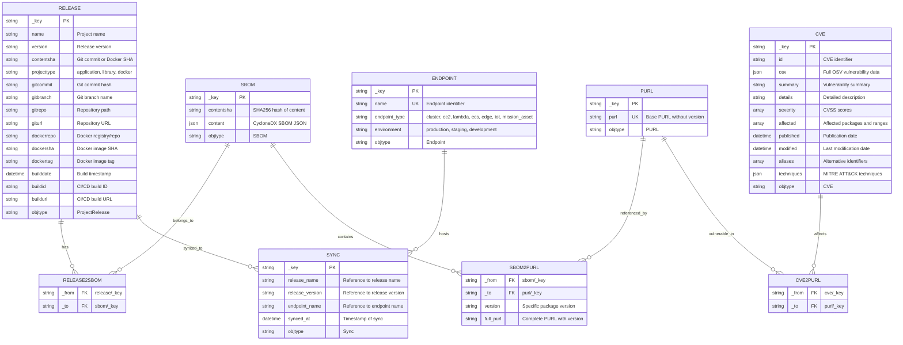

# Post-Deployment Vulnerability Remediation Architecture Documentation

## Executive Summary

Post-Deployment Vulnerability Remediation answers two critical questions for every high-risk OSS vulnerability: **"Where is it running, and how do I fix it?"**

The system bridges three key domains:

1. **Vulnerabilities (The Threat)** - CVE data from OSV.dev including affected packages, severity levels, version ranges, and fix information
2. **Project Releases (Where to Fix It)** - Git repositories, SBOMs, dependencies, binary artifacts, and release metadata from GitHub/GitLab
3. **Deployment Endpoints (Where It's Running)** - GitOps configurations showing production deployments across cloud providers

### Value Proposition

By connecting vulnerability data with project releases and their deployment locations, the system enables security teams to:

- Immediately identify which production systems are affected by new CVEs
- Trace vulnerable packages back to source code repositories
- Determine exact versions that need updating
- Locate deployment configurations for remediation
- Prioritize fixes based on actual deployment exposure

### Integration Points

**At Setup, Users Connect:**

| Code Repository | Binary Repository | GitOps Repository |
|----------------|-------------------|-------------------|
| GitHub/GitLab repos | Quay, DockerHub | GitHub/GitLab deployment repos |
| SBOMs & dependency files | ArtifactHub, Sonatype | Cloud provider configs |
| Source code & commits | JFrog, GitHub Packages | Kubernetes/ArgoCD manifests |

## Functional Requirements

### Vulnerability Data Management

The system automatically ingests vulnerability data from OSV.dev on a scheduled basis, supporting all major package ecosystems including npm, PyPI, Maven, Go, NuGet, and RubyGems. Vulnerability records are normalized into a consistent format, extracting Package URLs (PURLs) and deduplicating based on CVE identifiers and modification timestamps. When configured, the system enriches vulnerability data with MITRE ATT&CK technique mappings to provide additional context about attack patterns. All vulnerability information includes severity scores (CVSS), affected version ranges, and available fix versions.

### Release and SBOM Processing

The system accepts Software Bill of Materials (SBOMs) in CycloneDX format through both REST API and CLI interfaces. Each SBOM undergoes validation to ensure structural correctness before processing. The system extracts component information including package names, versions, and PURLs from the SBOM content. Comprehensive git metadata is automatically collected from repositories, including commit hashes, branch information, author details, and timestamps. Releases are deduplicated using a composite key of name, version, and content SHA, while SBOMs are deduplicated using SHA256 content hashing to prevent redundant storage. The system supports multiple project types (applications, libraries, Docker containers) and maintains relationships between releases and their corresponding SBOMs.

### Sync and Endpoint Management

The system tracks deployment of releases to endpoints, creating a complete picture of where software is running in production. Endpoints represent deployment targets such as Kubernetes clusters, cloud instances (EC2, Lambda, ECS), edge devices, IoT systems, and mission assets. Each endpoint is classified by type and environment (production, staging, development). Sync records associate specific release versions with endpoints, recording when each deployment occurred. This enables the system to answer "where is this vulnerability running" by traversing from CVEs through releases to their deployed endpoints. The unique composite index on sync records prevents duplicate deployments while supporting multiple syncs of the same release to different endpoints.

### Vulnerability Analysis

The system performs sophisticated vulnerability matching by connecting CVEs to affected releases through PURL-based graph relationships. Version matching follows OSV specifications, supporting both semantic versioning (SEMVER) and ecosystem-specific version schemes. The matching logic accurately identifies all releases affected by a given CVE and all CVEs affecting a given release. Version-specific matching is achieved through metadata stored on graph edges, allowing precise filtering that eliminates false positives. The system handles complex version range specifications including minimum versions, maximum versions, and specific version exclusions. Severity-based queries enable filtering vulnerabilities by CVSS score thresholds (critical ≥9.0, high ≥7.0, medium ≥4.0, low ≥0.0), and the system can identify all endpoints affected by vulnerabilities at a given severity level.

### Query and Reporting

Users can query the system through REST API endpoints to retrieve vulnerability information, release details, and deployment status. The system provides comprehensive listing of all releases with basic metadata, detailed retrieval of specific releases including full SBOMs, vulnerability reports for individual releases showing all affecting CVEs, and impact analysis for CVEs showing all affected releases and endpoints. Severity-based queries return all releases or endpoints affected by vulnerabilities at or above a specified severity threshold. All responses include actionable information such as severity levels, fix versions, affected packages, endpoint locations, and source repository information. The CLI supports exporting SBOMs to files for offline analysis and integration with other tools.

### Integration Capabilities

The system integrates with GitHub and GitLab repositories to collect source code metadata, build information, and commit histories. Support for multiple binary repositories (Quay, DockerHub, ArtifactHub, Sonatype, JFrog) enables tracking of artifacts through the software supply chain. GitOps repository integration allows the system to understand deployment configurations and identify where vulnerable code is actually running. Metadata collection works seamlessly in CI/CD environments including GitHub Actions and Jenkins, automatically gathering build numbers, URLs, and timestamps.

## Non-Functional Requirements

### Performance and Scalability

The system is designed to handle large-scale vulnerability management workloads efficiently. Individual CVE records are processed and stored in under 100 milliseconds (excluding network latency), while vulnerability matching queries complete in under two seconds for releases containing up to 500 components. The ingestion pipeline can process over 50,000 CVE records per hour, and the API service handles concurrent requests from 100+ clients without degradation. Database indexes optimize query performance for common access patterns, and connection pooling ensures efficient resource utilization. The system scales to support over one million releases, 500,000 unique SBOMs, 100,000 CVE records, and unlimited endpoint/sync records while maintaining responsive query performance. Severity-based queries across all CVEs use optimized single-pass traversal to avoid loading large result sets into memory.

### Reliability and Availability

The API service maintains 99.9% uptime during business hours through robust error handling and recovery mechanisms. Database connections implement exponential backoff retry logic to handle transient failures gracefully. The system recovers from network interruptions without data loss and uses panic recovery middleware to prevent service crashes from unexpected errors. All input data undergoes validation before processing to ensure data quality. The CVE ingestion job retries failed downloads up to three times before logging errors for manual intervention.

### Security

Security is embedded throughout the system architecture. All external communications use TLS 1.2 or higher for encryption. The system verifies GPG signatures on git commits when available to ensure code authenticity. ZipSlip protection prevents directory traversal attacks during archive extraction. All user inputs are sanitized to prevent injection attacks. Database connections require authentication, and sensitive credentials are never exposed in logs or error messages. CORS policies control API access, and SBOM content undergoes validation to prevent malicious data injection.

### Maintainability and Observability

The system uses structured logging with Zap to provide consistent, searchable log output across all components. Health check endpoints enable monitoring systems to verify service status. All CVE ingestion operations and API requests are logged with timestamps and response times for operational insight. The codebase maintains modular package architecture with clear separation of concerns, making it easy to understand and modify. API endpoints are fully documented with examples, and the CLI provides helpful error messages with suggested remediation steps. Database schema changes follow backwards compatibility principles to enable zero-downtime deployments.

### Portability and Interoperability

The system runs on Linux, macOS, and Windows, deployable via Docker containers and Kubernetes with Helm charts. All configuration uses environment variables, avoiding platform-specific dependencies. The implementation complies with industry standards including the CycloneDX SBOM specification, Package URL (PURL) specification, and OSV vulnerability data format. REST API follows standard HTTP conventions for methods and status codes, with JSON as the primary data exchange format. Semantic versioning specification governs all version comparisons, ensuring consistent behavior across different package ecosystems.

## Overview

Post-Deployment Vulnerability Remediation is a comprehensive vulnerability management system built in Go that tracks relationships between software releases, their Software Bill of Materials (SBOMs), known CVEs, and deployment endpoints. The system uses a graph database (ArangoDB) to create a hub-and-spoke architecture that enables efficient vulnerability analysis across software components and identifies where vulnerable code is running in production.

## Data Flow: Answering "Where & How to Fix"

### Question 1: "Where is this vulnerability running?"

**Data Sources:**

- **Vulnerability Data** (OSV.dev): Package name, affected version ranges, severity, CVE ID
- **Project Release Data** (GitHub/GitLab): Git commits, SBOMs, dependency files, release metadata
- **Sync Data** (API/Manual): Associations between releases and endpoints showing actual deployments

**Flow:**

```text
New CVE Alert → Match to PURL Hub → Find SBOMs with affected versions → 
Traverse to Releases → Link to Sync Records → Identify Endpoints
```

**Result:** Security teams know exactly which cloud endpoints, Kubernetes clusters, edge devices, and mission assets are running the vulnerable code.

### Question 2: "How do I fix it?"

**Data Sources:**

- **Fix Information** (OSV.dev): Fixed-in version, patch availability
- **Source Location** (GitHub/GitLab): Repository, branch, commit hash, package manager files
- **Binary Artifacts** (Quay/DockerHub/etc.): Container images, tags, signed artifacts
- **Release History**: Previous releases, upgrade paths, compatibility information

**Flow:**

```text
Identified Vulnerable Release → Trace to Source Repo → Find Fix Version → 
Locate Binary Artifact → Identify Sync Records → Generate Remediation Plan
```

**Result:** Teams have complete remediation path from source code to production deployment.

## Database Structure

The system uses ArangoDB, a multi-model database that supports both document storage and graph relationships. The database schema implements a hub-and-spoke architecture using PURL nodes as central hubs to connect CVEs with releases through their SBOMs, and extends to track which releases are synced to which endpoints.



### Key Design Features

**Hub-and-Spoke Architecture**: PURL nodes serve as central hubs connecting CVEs (which reference packages generically) to SBOMs (which include specific versions). This design eliminates duplication while maintaining precise version tracking through edge metadata.

**Version Storage Strategy**: While PURL nodes store base package identifiers without versions (e.g., `pkg:npm/lodash`), the SBOM2PURL edges store specific version information (e.g., `4.17.20`). This enables accurate vulnerability matching where CVEs specify affected version ranges.

**Content-Based Deduplication**: Releases use composite natural keys (name + version + contentsha) to handle rebuild scenarios, while SBOMs use SHA256 content hashing to enable sharing across multiple releases with identical dependencies.

**Sync Tracking**: Sync records create the critical link between releases and endpoints, enabling queries that answer "where is this vulnerability running in production?" Each sync records when a specific release version was deployed to a specific endpoint.

**Composite Indexes**: Multi-field indexes on `release.name + release.version`, `sbom2purl._to + sbom2purl.version`, and `sync.release_name + sync.release_version + sync.endpoint_name` optimize common query patterns.

**Bidirectional Traversal**: Edge collections are indexed on both `_from` and `_to` fields, enabling efficient graph traversal in both directions—from CVE to affected releases/endpoints and from releases/endpoints to applicable CVEs.

## Sync and Endpoint Architecture

### Endpoint Management

Endpoints represent deployment targets where releases are synced (deployed). Each endpoint has:

- **Name**: Unique identifier for the endpoint
- **Type**: Classification of the deployment target
- **Environment**: Operational context (production, staging, development)

**Supported Endpoint Types:**

- **Cloud Infrastructure**: cluster, ec2, lambda, ecs, eks, gke, aks, fargate
- **Edge Computing**: edge, iot
- **Mission Assets**: mission_asset (military and defense systems including satellites, ground systems, aircraft, ships, submarines, tanks, command posts, etc.)

### Sync Records

Sync records track which release versions are synced (deployed) to which endpoints. This creates the critical link between vulnerabilities and production systems.

**Key Features:**

- Associates release (by name and version) with endpoint (by name)
- Records sync timestamp for audit trails
- Enables vulnerability impact analysis across deployed systems
- Supports multiple syncs of same release to different endpoints
- Prevents duplicate syncs via unique composite index

### Answering "Where is it Running?"

The sync architecture enables the system to answer critical security questions:

**Query Pattern for Vulnerability Location:**

```text
CVE → cve2purl → PURL → sbom2purl (with version) → SBOM → release2sbom → Release → Sync → Endpoint
```

This traversal shows:

1. Which packages are vulnerable (CVE → PURL)
2. Which SBOMs contain vulnerable versions (PURL → SBOM)
3. Which releases use those SBOMs (SBOM → Release)
4. Where those releases are synced (Release → Sync → Endpoint)

**Result:** Complete visibility from CVE to production endpoints, including environment context and sync timestamps.

## System Components

### 1. CVE Ingestion Service (Cronjob)

**Repository:** `ortelius/cve2release-tracker`  
**Location:** `main.go` (root)

**Purpose:** Periodically fetches vulnerability data from OSV.dev and populates the database.

**Key Functions:**

- `LoadFromOSVDev()` - Fetches ecosystem list and downloads vulnerability data
- `unpackAndLoad()` - Extracts and processes ZIP files containing CVE data
- `newVuln()` - Processes individual CVE JSON, enriches with MITRE ATT&CK techniques, and creates graph relationships

**External Dependencies:**

- OSV.dev API for vulnerability data
- Optional MITRE ATT&CK mapping service for technique enrichment

**Workflow:**

1. Fetches list of ecosystems from OSV.dev
2. Downloads ZIP files for each ecosystem
3. Extracts individual CVE JSON files
4. Enriches CVE data with MITRE techniques (if configured)
5. Upserts CVE documents to the database
6. Extracts base PURLs (Package URLs without versions)
7. Creates PURL hub nodes
8. Creates edges from CVE to PURL for vulnerability matching

### 2. REST API Service

**Repository:** `ortelius/cve2release-tracker`  
**Location:** `main.go` (root) - Fiber web server

**Purpose:** Provides HTTP endpoints for managing releases, SBOMs, endpoints, syncs, and querying vulnerability data.

**Endpoints:**

#### POST `/api/v1/releases`

- Handler: `PostReleaseWithSBOM()`
- Creates/updates release and SBOM records
- Uses hybrid deduplication: composite key for releases, content hash for SBOMs
- Extracts SBOM components and creates hub-and-spoke PURL relationships

#### POST `/api/v1/sync`

- Handler: `PostSync()`
- Creates sync record associating a release with an endpoint
- Validates that both release and endpoint exist
- Prevents duplicate syncs via unique composite index

**Request Body:**

```json
{
  "release_name": "my-app",
  "release_version": "1.0.0",
  "endpoint_name": "production-cluster"
}
```

#### GET `/api/v1/releases/:name/:version`

- Handler: `GetReleaseWithSBOM()`
- Retrieves release metadata and associated SBOM

#### GET `/api/v1/releases/:name/:version/vulnerabilities`

- Handler: `GetReleaseVulnerabilities()`
- Returns all CVEs affecting a specific release
- Uses semantic versioning for accurate vulnerability matching

#### GET `/api/v1/severity/:severity/affected-releases`

- Handler: `GetAffectedReleasesBySeverity()`
- Returns all releases affected by CVEs at or above specified severity level
- Severity levels: critical (≥9.0), high (≥7.0), medium (≥4.0), low (≥0.0)
- Uses optimized single-pass query combining severity filtering with graph traversal
- Performs Go-based version range matching for accuracy

#### GET `/api/v1/severity/:severity/affected-endpoints`

- Handler: `GetEndpointsWithSeverity()`
- Returns all endpoints affected by CVEs at or above specified severity level
- Traverses from CVE through releases to synced endpoints
- Includes endpoint type, environment, and sync timestamp
- Uses optimized single-pass query to avoid loading all CVEs into memory

#### GET `/api/v1/releases`

- Handler: `ListReleases()`
- Lists all releases with key, name, and version

**Architecture Pattern:** Uses Fiber framework with middleware for CORS, logging, and recovery.

### 3. CLI Client

**Repository:** `ortelius/cve2release-tracker`  
**Location:** `cli/main.go` and `cmd/root.go`

**Purpose:** Command-line interface for interacting with the API service.

**Commands:**

#### `upload`

- Collects git metadata from local repository
- Validates and reads CycloneDX SBOM file
- Posts release with SBOM to API server

**Flags:**

- `--sbom, -s`: Path to SBOM file (required)
- `--type, -t`: Project type (application, library, docker, etc.)
- `--server`: API server URL (default: <http://localhost:3000>)
- `--verbose, -v`: Enable verbose output

#### `list`

- Retrieves and displays all releases from the database

#### `get [name] [version]`

- Fetches specific release with SBOM
- `--output, -o`: Write SBOM to file
- `--sbom-only`: Output only SBOM content

## Data Models

### ProjectRelease

**Repository:** `ortelius/cve2release-tracker`  
**Location:** `model/release.go`

Represents a versioned software release with comprehensive git and build metadata.

**Key Fields:**

- `Name`, `Version`: Primary identifiers
- `ContentSha`: Git commit or Docker SHA for deduplication
- `ProjectType`: application, library, docker, container, etc.
- Git metadata: commit, branch, authors, timestamps, verification
- Build metadata: build date, ID, URL
- Docker metadata: repo, SHA, tag

### SBOM

**Repository:** `ortelius/cve2release-tracker`  
**Location:** `model/sbom.go`

Stores CycloneDX Software Bill of Materials in JSON format.

**Key Fields:**

- `Content`: Raw CycloneDX JSON (json.RawMessage)
- `ContentSha`: SHA256 hash for deduplication
- `ObjType`: "SBOM"

### PURL

**Repository:** `ortelius/cve2release-tracker`  
**Location:** `model/purl.go`

Represents a Package URL hub (without version information).

**Key Fields:**

- `Purl`: Base PURL format (e.g., pkg:npm/lodash)
- `ObjType`: "PURL"

**Purpose:** Serves as a hub node to connect CVEs (which reference packages without versions) to SBOM components (which include specific versions).

### Endpoint

**Repository:** `ortelius/cve2release-tracker`  
**Location:** `model/endpoint.go`

Represents a deployment target for software releases.

**Key Fields:**

- `Name`: Unique endpoint identifier
- `EndpointType`: Type of deployment (cluster, ec2, lambda, mission_asset, etc.)
- `Environment`: Operational context (production, staging, development)
- `ObjType`: "Endpoint"

**Endpoint Types:**

- Cloud & Container: cluster, ec2, lambda, ecs, eks, gke, aks, fargate
- Edge & IoT: edge, iot
- Mission Assets: mission_asset (unified type for military/defense systems)

### Sync

**Repository:** `ortelius/cve2release-tracker`  
**Location:** `model/api.go`

Represents the association between a release and an endpoint (deployment).

**Key Fields:**

- `ReleaseName`: Reference to release name
- `ReleaseVersion`: Reference to release version
- `EndpointName`: Reference to endpoint name
- `SyncedAt`: Timestamp when sync occurred
- `ObjType`: "Sync"

**Purpose:** Tracks which releases are synced (deployed) to which endpoints, enabling vulnerability impact analysis across production systems.

### ReleaseWithSBOM

**Repository:** `ortelius/cve2release-tracker`  
**Location:** `model/api.go`

Composite structure for API requests/responses combining ProjectRelease and SBOM.

### AffectedRelease

**Repository:** `ortelius/cve2release-tracker`  
**Location:** `model/api.go`

Response structure for releases affected by CVEs.

**Key Fields:**

- CVE information: ID, summary, details, severity, published/modified dates, aliases
- Package information: package name, affected version, full PURL
- Release information: name, version, content SHA, project type

### AffectedEndpoint

**Repository:** `ortelius/cve2release-tracker`  
**Location:** `model/api.go`

Response structure for endpoints affected by CVEs.

**Key Fields:**

- All fields from AffectedRelease, plus:
- Endpoint information: name, type, environment
- Sync information: timestamp when release was synced to endpoint

**Purpose:** Provides complete vulnerability impact view including where vulnerable code is running.

## Database Architecture

**Repository:** `ortelius/cve2release-tracker`  
**Location:** `database/database.go`

### Technology

ArangoDB - Multi-model database supporting both documents and graphs.

### Document Collections

#### `release`

Stores project release metadata. Indexed on:

- `name` + `version` (composite)
- `contentsha`

#### `sbom`

Stores SBOM content. Indexed on:

- `contentsha` (for deduplication)

#### `purl`

Stores base package URLs (hub nodes). Indexed on:

- `purl` (unique index)

#### `cve`

Stores CVE/vulnerability data in OSV format. Indexed on:

- `id`
- `osv.id`
- `affected[*].package.name`
- `affected[*].package.purl`

#### `endpoint`

Stores deployment target definitions. Indexed on:

- `name` (unique index - prevents duplicate endpoints)
- `endpoint_type`
- `environment`

#### `sync`

Stores release-to-endpoint sync records. Indexed on:

- `release_name`
- `release_version`
- `endpoint_name`
- `synced_at`
- `release_name + release_version` (composite)
- `release_name + release_version + endpoint_name` (unique composite - prevents duplicate syncs)

### Edge Collections

#### `release2sbom`

Connects releases to their SBOMs.

- `_from`: release/{key}
- `_to`: sbom/{key}

#### `sbom2purl`

Connects SBOMs to package hubs **with version information**.

- `_from`: sbom/{key}
- `_to`: purl/{key}
- `version`: Specific package version (critical for CVE matching)
- `full_purl`: Complete PURL with version

**Indexed on:** `_from`, `_to`, `_to + version` (composite)

#### `cve2purl`

Connects CVEs to affected package hubs.

- `_from`: cve/{key}
- `_to`: purl/{key}

**Indexed on:** `_from`, `_to`

## Hub-and-Spoke Architecture

The system implements a sophisticated hub-and-spoke pattern using PURL nodes as hubs:

### Concept

1. **PURL Hubs**: Base package identifiers without versions (e.g., `pkg:npm/lodash`)
2. **Spokes with Versions**: Edges from SBOMs to PURL hubs store specific version information
3. **CVE Connections**: CVEs link to PURL hubs (as OSV data references packages generically)
4. **Sync Extensions**: Releases connect to endpoints through sync records

### Benefits

1. **Deduplication**: Single PURL hub for each package across all releases
2. **Efficient Queries**: Graph traversal from CVE → PURL → SBOM → Release → Sync → Endpoint
3. **Version Flexibility**: Version information on edges allows precise matching
4. **Scalability**: Reduces node count while maintaining relationship fidelity
5. **Impact Analysis**: Complete path from vulnerability to production deployment

### Version Matching Strategy

The system uses a hybrid approach:

1. **AQL Pre-filtering**: Database queries fetch candidate matches via hub connections
2. **Go-based Filtering**: Semantic version range matching using `semver` library
3. **OSV Range Support**: Handles ECOSYSTEM and SEMVER range types
4. **Severity Filtering**: Numeric threshold comparison using CVSS scores

### Severity-Based Queries

Severity queries use optimized single-pass traversal:

1. **Threshold Conversion**: String severity (critical/high/medium/low) converts to numeric CVSS threshold
2. **Combined Filtering**: Single AQL query filters CVEs by severity AND traverses to releases/endpoints
3. **Memory Efficiency**: Avoids loading all CVEs into memory by processing candidates in stream
4. **Version Validation**: Go code performs final semantic version checking on candidates

## Query Patterns

### Finding Vulnerabilities for a Release

```text
Release → release2sbom → SBOM → sbom2purl (with version) → PURL → cve2purl → CVE
```

Then filter CVEs where the version matches the affected range.

### Finding Affected Releases for a CVE

```text
CVE → cve2purl → PURL → sbom2purl (with version) → SBOM → release2sbom → Release
```

Then filter by version range matching.

### Finding Affected Endpoints for a CVE

```text
CVE → cve2purl → PURL → sbom2purl (with version) → SBOM → release2sbom → Release → Sync → Endpoint
```

Then filter by version range matching and enrich with endpoint details.

### Finding Affected Releases by Severity

```text
CVE (filtered by CVSS ≥ threshold) → cve2purl → PURL → sbom2purl (with version) → SBOM → release2sbom → Release
```

Single-pass query combining severity filter with graph traversal.

### Finding Affected Endpoints by Severity

```text
CVE (filtered by CVSS ≥ threshold) → cve2purl → PURL → sbom2purl (with version) → SBOM → release2sbom → Release → Sync → Endpoint
```

Single-pass query combining severity filter with complete graph traversal to endpoints.

## Utility Layer

**Repository:** `ortelius/cve2release-tracker`

### PURL Processing

**Location:** `util/helpers.go`

**Functions:**

- `CleanPURL()`: Removes qualifiers and subpaths for canonical form
- `GetBasePURL()`: Strips version to create hub identifier
- `ParsePURL()`: Parses PURL strings
- `EcosystemToPurlType()`: Maps OSV ecosystems to PURL types

### Version Matching

**Location:** `util/helpers.go`

**Functions:**

- `IsVersionAffected()`: Checks if version matches OSV vulnerability data
- `isVersionInRange()`: Semantic version range checking
- Uses `github.com/Masterminds/semver/v3` for accurate semver comparison

### Git Metadata Collection

**Location:** `util/env_mapping.go`

**Functions:**

- `GetDerivedEnvMapping()`: Collects comprehensive git metadata
- `assignMetaData()`: Executes git commands to extract repository information
- Supports CI/CD environments (GitHub Actions, generic CI)

**Collected Metadata:**

- Commit information (hash, author, timestamp, verification)
- Branch information (name, parent, creation)
- Repository information (URL, org, project)
- Build information (ID, number, URL)
- Code statistics (lines added/deleted/total)

## Security Features

1. **Signed Commit Verification**: Tracks GPG signature verification
2. **Content-based Deduplication**: SHA256 hashing prevents duplicate data
3. **TLS Configuration**: Secure connections with configurable verification
4. **Input Validation**:
   - SBOM format validation (CycloneDX)
   - Required field checking
   - JSON structure validation
   - Endpoint and release existence verification for syncs
5. **ZipSlip Protection**: Path validation during archive extraction
6. **Unique Constraints**: Database-level enforcement prevents duplicate endpoints and duplicate syncs

## Deduplication Strategy

### Release Deduplication

Uses **composite natural key**:

- `name` + `version` + `contentsha`

**Rationale:** Same release can have different content (e.g., rebuilds), so ContentSha ensures uniqueness.

### SBOM Deduplication

Uses **content-based hashing**:

- SHA256 hash of entire SBOM content

**Rationale:** Identical SBOMs can be shared across multiple releases, saving storage and improving query performance.

### PURL Deduplication

Uses **unique base PURL**:

- Enforced by unique index on `purl` field

**Rationale:** Single hub node per package enables efficient vulnerability tracking.

### Endpoint Deduplication

Uses **unique endpoint name**:

- Enforced by unique index on `name` field

**Rationale:** Each endpoint has a unique identifier preventing duplicate definitions.

### Sync Deduplication

Uses **unique composite key**:

- `release_name` + `release_version` + `endpoint_name`

**Rationale:** Prevents duplicate syncs of the same release to the same endpoint while allowing a release to be synced to multiple endpoints and an endpoint to host multiple releases.

## Performance Optimizations

1. **Composite Indexes**: Multi-field indexes for common query patterns
   - `release.name + release.version` - Fast release lookups
   - `sbom2purl._to + sbom2purl.version` - Efficient version matching
   - `sync.release_name + sync.release_version` - Quick sync queries
   - `sync.release_name + release_version + endpoint_name` - Unique constraint and fast lookups
2. **Edge Indexes**: Optimized traversal with `_from` and `_to` indexes on all edge collections
3. **Version-aware Queries**: Version stored on edges reduces full document scans
4. **Connection Pooling**: HTTP transport with connection reuse
5. **Backoff Retry**: Exponential backoff for database connection establishment
6. **Single-Pass Queries**: Severity-based queries combine filtering with traversal to avoid loading large datasets into memory
7. **Streaming Results**: AQL cursors process results incrementally rather than loading all data at once

## Extensibility Points

1. **MITRE Integration**: Optional enrichment service for attack technique mapping
2. **Ecosystem Support**: Extensible PURL type mapping for new package ecosystems
3. **Project Types**: Flexible project type field for diverse software categories
4. **Endpoint Types**: Extensible endpoint type enum for new deployment targets
5. **Custom Metadata**: Git metadata collection extensible via environment variables
6. **Multiple Ranges**: OSV range format supports various versioning schemes
7. **Severity Thresholds**: Configurable CVSS score thresholds for severity levels

## Deployment Considerations

### CVE Ingestion Service

- Runs as Kubernetes CronJob
- Environment variables: `ARANGO_HOST`, `ARANGO_PORT`, `ARANGO_USER`, `ARANGO_PASS`, `MITRE_MAPPING_URL`
- Resource requirements: Network bandwidth for OSV downloads, CPU for JSON processing

### API Service

- Runs as Kubernetes Deployment
- Port: 3000 (configurable via `PORT` environment variable)
- Health check endpoint: `/health`
- Middleware: CORS, logging, panic recovery

### Database

- ArangoDB deployment with persistent storage
- Recommended: 3-node cluster for high availability
- Backup strategy for vulnerability data
- Storage considerations: Add capacity for endpoint and sync collections

### Sync Management

- Syncs can be created via API POST requests
- Consider automation through CI/CD pipelines or GitOps controllers
- Sync records provide audit trail of deployments
- Regular cleanup of old sync records may be needed for long-running systems

## Technology Stack

- **Language:** Go 1.21+
- **Web Framework:** Fiber v2
- **Database Driver:** `github.com/arangodb/go-driver/v2`
- **CLI Framework:** Cobra
- **Version Parsing:** `github.com/Masterminds/semver/v3`
- **PURL Parsing:** `github.com/package-url/packageurl-go`
- **OSV Models:** `github.com/google/osv-scanner/pkg/models`
- **Logging:** Zap (structured logging)

## Key Design Decisions

1. **Graph Database Choice**: ArangoDB selected for native graph traversal and document flexibility
2. **Hub-and-Spoke Pattern**: Reduces data duplication while enabling efficient queries
3. **Version-on-Edge Storage**: Critical for accurate CVE matching without denormalization
4. **Hybrid Deduplication**: Different strategies for releases (composite key) vs SBOMs (content hash)
5. **Go-based Version Matching**: Database pre-filters, Go performs accurate semantic versioning
6. **Content Immutability**: SBOMs treated as immutable content-addressed objects
7. **CycloneDX Standard**: Adopted industry-standard SBOM format for interoperability
8. **Post-Deployment Focus**: Architecture optimized for answering "where running" and "how to fix" questions after vulnerabilities are discovered in production environments
9. **Sync Tracking**: Separate sync records enable flexible many-to-many relationships between releases and endpoints
10. **Severity-Based Queries**: Numeric threshold filtering enables efficient severity-level analysis
11. **Single-Pass Traversal**: Combined filtering and traversal queries optimize performance for large-scale vulnerability analysis
12. **Mission Asset Support**: Unified endpoint type for military/defense systems simplifies classification while allowing metadata-based specialization

## Use Cases and Examples

### Use Case 1: New Critical CVE Discovered

**Scenario:** A critical vulnerability (CVE-2024-1234) is discovered in lodash@4.17.20.

**System Response:**

1. CVE ingestion service downloads and processes the new CVE
2. Creates PURL hub for `pkg:npm/lodash`
3. Creates edge from CVE to PURL hub

**Security Team Action:**

```bash
# Query all endpoints affected by critical vulnerabilities
curl http://localhost:3000/api/v1/severity/critical/affected-endpoints
```

**Result:** Complete list showing:

- Which releases contain the vulnerable lodash version
- Which endpoints are running those releases
- Environment classification (production, staging, etc.)
- When each release was synced to each endpoint
- Source repository and commit information for patching

### Use Case 2: Release Deployment Tracking

**Scenario:** A new release of "my-app" version 2.0.0 is deployed to production.

**Developer Action:**

```bash
# Upload SBOM during CI/CD
./cve2release-cli upload --sbom sbom.json --type application --server https://api.example.com

# Record deployment to production cluster
curl -X POST https://api.example.com/api/v1/sync \
  -H "Content-Type: application/json" \
  -d '{
    "release_name": "my-app",
    "release_version": "2.0.0",
    "endpoint_name": "production-k8s-cluster"
  }'
```

**Result:** System can now answer:

- What vulnerabilities affect this release?
- Where is this release deployed?
- When was it deployed?

### Use Case 3: Mission Asset Vulnerability Assessment

**Scenario:** Security team needs to identify all mission assets affected by high-severity vulnerabilities.

**Security Team Action:**

```bash
# Query all mission assets with high or critical vulnerabilities
curl http://localhost:3000/api/v1/severity/high/affected-endpoints | \
  jq '.affected_endpoints[] | select(.endpoint_type == "mission_asset")'
```

**Result:** Filtered list showing only mission assets (satellites, aircraft, ships, etc.) affected by vulnerabilities with CVSS ≥ 7.0.

### Use Case 4: Environment-Specific Risk Analysis

**Scenario:** Assess production environment exposure to medium and higher vulnerabilities.

**Security Team Action:**

```bash
# Get all affected endpoints
curl http://localhost:3000/api/v1/severity/medium/affected-endpoints | \
  jq '.affected_endpoints[] | select(.environment == "production")'
```

**Result:** Production-only vulnerability exposure report with:

- CVE details and severity scores
- Affected packages and versions
- Production endpoints running vulnerable code
- Release information for patching

### Use Case 5: Audit Trail and Compliance

**Scenario:** Demonstrate when vulnerable software was deployed and to which systems.

**Compliance Team Action:**

- Query sync records to show deployment history
- Cross-reference with CVE publication dates
- Generate reports showing response time from CVE disclosure to remediation

**Result:** Complete audit trail showing:

- When releases were synced to endpoints
- Which releases contained vulnerabilities
- Timeline of vulnerability exposure

## API Request/Response Examples

### Example 1: Create Sync Record

**Request:**

```bash
POST /api/v1/sync
Content-Type: application/json

{
  "release_name": "payment-service",
  "release_version": "3.1.4",
  "endpoint_name": "prod-eks-us-east"
}
```

**Response:**

```json
{
  "success": true,
  "message": "Successfully synced release payment-service version 3.1.4 to endpoint prod-eks-us-east",
  "sync_key": "123456"
}
```

### Example 2: Query Critical Vulnerabilities on Endpoints

**Request:**

```bash
GET /api/v1/severity/critical/affected-endpoints
```

**Response:**

```json
{
  "success": true,
  "severity": "critical",
  "count": 2,
  "affected_endpoints": [
    {
      "cve_id": "CVE-2024-1234",
      "summary": "Remote code execution in lodash",
      "severity": "9.8",
      "package": "pkg:npm/lodash",
      "affected_version": "4.17.20",
      "release_name": "web-app",
      "release_version": "2.1.0",
      "endpoint_name": "production-k8s-cluster",
      "endpoint_type": "cluster",
      "environment": "production",
      "synced_at": "2024-01-15T10:30:00Z"
    },
    {
      "cve_id": "CVE-2024-5678",
      "summary": "SQL injection vulnerability",
      "severity": "9.1",
      "package": "pkg:npm/sequelize",
      "affected_version": "6.28.0",
      "release_name": "api-service",
      "release_version": "1.5.2",
      "endpoint_name": "mission-asset-satellite-01",
      "endpoint_type": "mission_asset",
      "environment": "production",
      "synced_at": "2024-01-20T14:22:00Z"
    }
  ]
}
```

### Example 3: Query Releases Affected by High Severity

**Request:**

```bash
GET /api/v1/severity/high/affected-releases
```

**Response:**

```json
{
  "success": true,
  "severity": "high",
  "count": 1,
  "affected_releases": [
    {
      "cve_id": "CVE-2024-9999",
      "summary": "Denial of service vulnerability",
      "severity": "7.5",
      "package": "pkg:npm/express",
      "affected_version": "4.18.0",
      "release_name": "auth-service",
      "release_version": "2.3.1",
      "content_sha": "abc123def456",
      "project_type": "application"
    }
  ]
}
```

## Integration Workflows

### CI/CD Pipeline Integration

```yaml
# GitHub Actions example
name: Build and Track Release
on:
  push:
    branches: [main]

jobs:
  build:
    runs-on: ubuntu-latest
    steps:
      - uses: actions/checkout@v2
      
      - name: Generate SBOM
        run: |
          syft . -o cyclonedx-json > sbom.json
      
      - name: Upload to CVE Tracker
        run: |
          ./cve2release-cli upload \
            --sbom sbom.json \
            --type application \
            --server ${{ secrets.CVE_TRACKER_URL }}
      
      - name: Deploy to Production
        run: |
          kubectl apply -f deployment.yaml
      
      - name: Record Sync
        run: |
          curl -X POST ${{ secrets.CVE_TRACKER_URL }}/api/v1/sync \
            -H "Content-Type: application/json" \
            -d '{
              "release_name": "${{ github.event.repository.name }}",
              "release_version": "${{ github.sha }}",
              "endpoint_name": "production-k8s"
            }'
```

### GitOps Integration

```yaml
# ArgoCD sync hook
apiVersion: v1
kind: ConfigMap
metadata:
  name: cve-tracker-sync-hook
data:
  sync.sh: |
    #!/bin/bash
    RELEASE_NAME=$(yq e '.metadata.name' deployment.yaml)
    RELEASE_VERSION=$(yq e '.spec.template.spec.containers[0].image' deployment.yaml | cut -d: -f2)
    
    curl -X POST ${CVE_TRACKER_URL}/api/v1/sync \
      -H "Content-Type: application/json" \
      -d "{
        \"release_name\": \"${RELEASE_NAME}\",
        \"release_version\": \"${RELEASE_VERSION}\",
        \"endpoint_name\": \"${ARGOCD_APP_NAME}\"
      }"
```

## Monitoring and Alerting

### Recommended Metrics

- Number of critical/high vulnerabilities per environment
- Number of affected endpoints by endpoint type
- Time from CVE publication to detection in system
- Number of syncs per day/week
- Unique endpoints with vulnerabilities

### Sample Alert Rules

```yaml
# Prometheus alert example
groups:
  - name: vulnerability_alerts
    rules:
      - alert: CriticalVulnerabilityInProduction
        expr: cve_tracker_critical_vulns{environment="production"} > 0
        for: 5m
        annotations:
          summary: "Critical vulnerabilities detected in production"
          
      - alert: MissionAssetVulnerable
        expr: cve_tracker_high_vulns{endpoint_type="mission_asset"} > 0
        for: 1m
        annotations:
          summary: "Mission asset affected by high severity vulnerability"
```

## Conclusion

This Post-Deployment Vulnerability Remediation system provides comprehensive visibility into software vulnerabilities across the entire deployment lifecycle. By connecting CVE data with releases, SBOMs, and actual deployment endpoints, security teams can quickly answer the critical questions: "Where is this vulnerability running?" and "How do I fix it?" The hub-and-spoke architecture ensures scalability and performance, while the sync tracking mechanism provides the crucial link between code and production systems.
